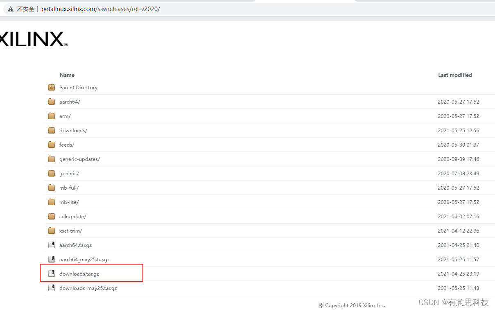

# zynq-7000

## petalinux创建工程

```sh
# 1.创建一个工程
petalinux-create --type project --template zynq --name ax_peta
# 2.配置vivado导出的硬件信息, 创建hdf文件，将*.hdf放入hdf文件夹中,工程不能使用挂载其他盘的方式，否则这一步报错.
petalinux-config --get-hw-description ./hdf
#若配置错误查看./build/config.log 文件。
#EBAZ4205矿卡是256m的，写成0x100000000就是256m的边界。修改“u-boot Configuration”->“netboot offset”项的值为0x08000000
# 3.配置linux内核
petalinux-config -c kernel
petalinux-config -c u-boot
# 4.配置根文件系统
petalinux-config -c rootfs
# 5.编译
petalinux-build
# 6.生成BOOT文件
petalinux-package --boot --fsbl ./images/linux/zynq_fsbl.elf --fpga --u-boot --force
petalinux-package --boot --fsbl --fpga ./images/linux/system.bit --u-boot  --force
#区别就是不指定时使用默认的文件打包
#INFO: File in BOOT BIN: "/home/ucas/1146/1146_new/images/linux/zynq_fsbl.elf"
#INFO: File in BOOT BIN: "/home/ucas/1146/1146_new/images/linux/system.bit"
#INFO: File in BOOT BIN: "/home/ucas/1146/1146_new/images/linux/u-boot.elf"

# 7.如果需要把内核也打包到BOOT.BIN文件中时
petalinux-package --boot --fsbl ./images/linux/zynq_fsbl.elf --fpga ./images/linux/system.bit --u-boot --kernel --force
petalinux-package --boot --fsbl --fpga ./images/linux/system.bit --u-boot --kernel --force
```

## 更换hdf文件并重新生成内核

```sh
# 1.清理旧临时文件
petalinux-build -x mrproper
petalinux-build -x distclean
# 2.重新配置hdf文件
petalinux-config --get-hw-description=./hdf
# 3.切换hdf文件
# 4.编译
petalinux-build

petalinux-build -x mrproper;petalinux-build -x distclean;petalinux-config --get-hw-description=./hdf
petalinux-build;petalinux-package --boot --fsbl --fpga ./images/linux/system.bit --u-boot  --force
```

## petalinux创建驱动

```sh
# 1.创建驱动框架，ax_peta/project-spec/meta-user/recipes-modules， 下面有了名为 ax-led-drv 文件夹，再迕入目弽…/ax_peta/project-spec/meta-user/recipes-modules/ax-led-drv/files，目录下名为 ax-led-drv.c 的文件就是 petalinux 帮我们新建的驱劢文件
petalinux-create -t modules --name ax-led-drv
```

## 配置本地源代码

### 内核与U-BOOT配置本地源码

```sh
#1.使用petalinux-config打开配置界面
petalinux-config
#2.设置linux-kernel类型为ext-local-src,会出现让你输入本地内核源码的路径，填写即可。
```


### 软件包配置本地源码

1.新工程的编译可能非常耗时，因为编译时会从xilinx官网下载很多需要的软件包建议将其下载至本地，配置为本地编译。

```shell
1.在工程目录下执行 petalinux-config

2.配置界面依次选择 Yocto Settings ---> Add pre-mirror url

3.将需要的文件下载至本地，并配置目录如下
```

 2.downloads完整包下载地址：[Index of /sswreleases/rel-v2020](http://petalinux.xilinx.com/sswreleases/rel-v2020/)



3.配置界面依次选择 Yocto Settings ---> Local sstate feeds settings ---> local sstate feeds url

配置本地sstate-cache目录如下：


Add pre-mirror url 设置成对应目录下的downloads。


4.缺省情况下，PetaLinux在编译完成后会删除源代码，以节省硬盘空间。在project-spec/meta-user/conf/petalinuxbsp.conf里，添加如下内容，可以保留Linux和UBoot源代码。

```sh
./project-spec/meta-user/conf/petalinuxbsp.conf

# 修改如下:
RM_WORK_EXCLUDE += "linux-xlnx"
RM_WORK_EXCLUDE += "u-boot-xlnx"
```

## i2c

./project-spec/meta-user/conf/petalinuxbsp.conf

## SPI

```sh
#spi 回环测试
./spidev_test -D /dev/w25q64 -v -l
```


## busybox的reboot流程

```c
#busybox启动的时候，会注册reboot的处理信号
init_main
        bb_signals(0
            + (1 << SIGUSR1) /* halt */
            + (1 << SIGTERM) /* reboot */
            + (1 << SIGUSR2) /* poweroff */
            , halt_reboot_pwoff);
        signal(SIGQUIT, restart_handler); /* re-exec another init */          
```

## 使用自定义内核镜像重新打包image.ub

```sh
export ARCH=arm
export CROSS_COMPILE=arm-linux-gnueabihf-
```

[./转载的一些文章/如何直接修改 image.ub.pdf]: ./转载的一些文章/如何直接修改image.ub.pdf    "点击跳转对应的md"

其中fitimage.its文件示例：

```ini
/dts-v1/;

/ {
        description = "U-Boot fitImage for PetaLinux";
        #address-cells = <1>;

        images {
                kernel@1 {
                        description = "Linux kernel";
                        data = /incbin/("zImage");
                        type = "kernel";
                        arch = "arm";
                        os = "linux";
                        compression = "none";
                        load = <0x80000>;
                        entry = <0x80000>;
                        hash@1 {
                                algo = "sha1";
                        };
                };
                fdt@system-top.dtb {
                        description = "Flattened Device Tree blob";
                        data = /incbin/("system-top.dtb");
                        type = "flat_dt";
                        arch = "arm";
                        compression = "none";

                        hash@1 {
                                algo = "sha1";
                        };
                };
                ramdisk@1 {
                        description = "petalinux-user-image";
                        data = /incbin/("rootfs.cpio.gz");
                        type = "RAMDisk";
                        arch = "arm";
                        os = "linux";
                        compression = "gzip";


                        hash@1 {
                                algo = "sha1";
                        };
                };
        };

        configurations {
                default = "conf@system-top.dtb";
                conf@system-top.dtb {
                        description = "1 Linux kernel, FDT blob, ramdisk";
                        kernel = "kernel@1";
                        fdt = "fdt@system-top.dtb";
                        ramdisk = "ramdisk@1";

                        hash@1 {
                                algo = "sha1";
                        };
                };
        };
};
```

其中内核的类型必须为kernel,其他的显示不成功，不识别kernel Image等。

ramdisk类型为RAMDisk，其他类型不识别，RAMDisk Image也不识别。
