# 深入linux内核架构

## Linux进程管理子系统

### 一、进程的表现形式

#### 1.进程生命周期

运行：该进程此刻正在执行。

等待：进程能够运行，但没有得到许可，因为CPU分配给另一个进程。调度器可以在下一次
任务切换时选择该进程。

睡眠：进程正在睡眠无法运行，因为它在等待一个外部事件。调度器无法在下一次任务切换
时选择该进程。

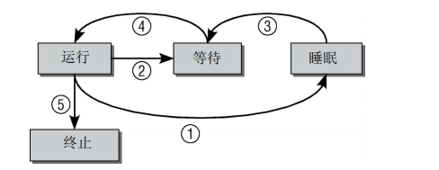


#### 2.进程表示

include/linux/sched.h中有结构体struct task_struct;表示了进程的所有信息。

```c
struct task_struct { 
    volatile long state; /* -1表示不可运行，0表示可运行，>0表示停止 */ 
    void *stack; 
    atomic_t usage; 
    unsigned long flags; /* 每进程标志，下文定义 */ 
    unsigned long ptrace; 
    int lock_depth; /* 大内核锁深度 */ 
    int prio, static_prio, normal_prio; 
    struct list_head run_list; 
    const struct sched_class *sched_class; 
    struct sched_entity se; 
    unsigned short ioprio; 
    unsigned long policy; 
    cpumask_t cpus_allowed; 
    unsigned int time_slice; 
    #if defined(CONFIG_SCHEDSTATS) || defined(CONFIG_TASK_DELAY_ACCT) 
    struct sched_info sched_info; 
    #endif 
    struct list_head tasks; 
    /* 
    * ptrace_list/ptrace_children链表是ptrace能够看到的当前进程的子进程列表。
    */ 
    struct list_head ptrace_children; 
    struct list_head ptrace_list; 
    struct mm_struct *mm, *active_mm; 
    /* 进程状态 */ 
    struct linux_binfmt *binfmt; 
    long exit_state; 
    int exit_code, exit_signal; 
    int pdeath_signal; /* 在父进程终止时发送的信号 */ 
    unsigned int personality; 
    unsigned did_exec:1; 
    pid_t pid; 
    pid_t tgid; 
    /* 
    * 分别是指向（原）父进程、最年轻的子进程、年幼的兄弟进程、年长的兄弟进程的指针。
    *（p->father可以替换为p->parent->pid）
    */ 
    struct task_struct *real_parent; /* 真正的父进程（在被调试的情况下） */ 
    struct task_struct *parent; /* 父进程 */ 
    /* 
    * children/sibling链表外加当前调试的进程，构成了当前进程的所有子进程
    */ 
    struct list_head children; /* 子进程链表 */ 
    struct list_head sibling; /* 连接到父进程的子进程链表 */ 
    struct task_struct *group_leader; /* 线程组组长 */ 
    /* PID与PID散列表的联系。 */ 
    struct pid_link pids[PIDTYPE_MAX]; 
    struct list_head thread_group; 
    struct completion *vfork_done; /* 用于vfork() */ 
    int __user *set_child_tid; /* CLONE_CHILD_SETTID */ 
    int __user *clear_child_tid; /* CLONE_CHILD_CLEARTID */ 
    unsigned long rt_priority; 
    cputime_t utime, stime, utimescaled, stimescaled; 
    unsigned long nvcsw, nivcsw; /* 上下文切换计数 */ 
    struct timespec start_time; /* 单调时间 */ 
    struct timespec real_start_time; /* 启动以来的时间 */ 
    /* 内存管理器失效和页交换信息，这个有一点争论。它既可以看作是特定于内存管理器的，
    也可以看作是特定于线程的 */ 
    unsigned long min_flt, maj_flt; 
    cputime_t it_prof_expires, it_virt_expires; 
    unsigned long long it_sched_expires; 
    struct list_head cpu_timers[3]; 
    /* 进程身份凭据 */ 
    uid_t uid,euid,suid,fsuid; 
    gid_t gid,egid,sgid,fsgid; 
    struct group_info *group_info; 
    kernel_cap_t cap_effective, cap_inheritable, cap_permitted; 
    unsigned keep_capabilities:1; 
    struct user_struct *user; 
    char comm[TASK_COMM_LEN]; /* 除去路径后的可执行文件名称
     -用[gs]et_task_comm访问（其中用task_lock()锁定它）
     -通常由flush_old_exec初始化 */ 
    /* 文件系统信息 */ 
    int link_count, total_link_count; 
    /* ipc相关 */ 
    struct sysv_sem sysvsem; 
    /* 当前进程特定于CPU的状态信息 */ 
    struct thread_struct thread; 
    /* 文件系统信息 */ 
    struct fs_struct *fs; 
    /* 打开文件信息 */ 
    struct files_struct *files; 
    /* 命名空间 */ 
    struct nsproxy *nsproxy; 
    /* 信号处理程序 */ 
    struct signal_struct *signal; 
    struct sighand_struct *sighand; 
    sigset_t blocked, real_blocked; 
    sigset_t saved_sigmask; /* 用TIF_RESTORE_SIGMASK恢复 */ 
    struct sigpending pending; 
    unsigned long sas_ss_sp; 
    size_t sas_ss_size; 
    int (*notifier)(void *priv); 
    void *notifier_data; 
    sigset_t *notifier_mask; 
    #ifdef CONFIG_SECURITY 
    void *security; 
    #endif 
    /* 线程组跟踪 */ 
    u32 parent_exec_id; 
    u32 self_exec_id; 
    /* 日志文件系统信息 */ 
    void *journal_info; 
    /* 虚拟内存状态 */ 
    struct reclaim_state *reclaim_state; 
    struct backing_dev_info *backing_dev_info; 
    struct io_context *io_context; 
    unsigned long ptrace_message; 
    siginfo_t *last_siginfo; /* 由ptrace使用。*/ 
    ... 
};
```


进程限制：

```sh
RLIMIT_CPU #按毫秒计算的最大CPU时间
RLIMIT_FSIZE #允许的最大文件长度
RLIMIT_DATA #数据段的最大长度
RLIMIT_STACK #（用户状态）栈的最大长度
RLIMIT_CORE #内存转储文件的最大长度
RLIMIT_RSS #常驻内存的最大尺寸。换句话说，进程使用页帧的最大数目。目前未使用
RLIMIT_NPROC #与进程真正UID关联的用户可以拥有的进程的最大数目
RLIMIT_NOFILE #打开文件的最大数目
RLIMIT_MEMLOCK #不可换出页的最大数目
RLIMIT_AS #进程占用的虚拟地址空间的最大尺寸
RLIMIT_LOCKS #文件锁的最大数目
RLIMIT_SIGPENDING #待决信号的最大数目
RLIMIT_MSGQUEUE #信息队列的最大数目
RLIMIT_NICE #非实时进程的优先级（nice level）
RLIMIT_RTPRIO #最大的实时优先级
```


##### 命名空间：

概念：就是c++命名空间的意思，隔离资源。

创建：

1.用fork或者clone系统调用创建新进程时，有特定的选项可以控制使用使用新命名空间或者使用父命名空间。

2.unshare系统调用将进程的某些部分与父进程分离，包括命名空间。


进程类中命名空间结构体：

```c
struct nsproxy {
	atomic_t count;
	struct uts_namespace *uts_ns;
	struct ipc_namespace *ipc_ns;
	struct mnt_namespace *mnt_ns;
	struct pid_namespace *pid_ns;
	struct net 	     *net_ns;
};
```

* UTS命名空间：
* ipc命名空间：
* mnt命名空间：
* pid命名空间：
* net命名空间：


##### 进程id号：

​	UNIX进程总是会分配一个号码用于在其命名空间中唯一地标识它们。该号码被称作进程ID号，
简称PID。用fork或clone产生的每个进程都由内核自动地分配了一个新的唯一的PID值。


#### 3.进程的系统调用

fork->sys_fork     }

vfork->sys_vfork  }---->do_fork

clone->sys_clone }

```c
//arch/x86/kernel/process_32.c 
asmlinkage int sys_clone(struct pt_regs regs) 
{ 
	unsigned long clone_flags; 
	unsigned long newsp; 
	int __user *parent_tidptr, *child_tidptr; 
	clone_flags = regs.ebx; 
	newsp = regs.ecx; 
	parent_tidptr = (int __user *)regs.edx; 
	child_tidptr = (int __user *)regs.edi; 
	if (!newsp) 
		newsp = regs.esp; 
	return do_fork(clone_flags, newsp, &regs, 0, parent_tidptr, child_tidptr); 
}

asmlinkage int sys_fork(long r10, long r11, long r12, long r13, long mof, long srp,struct pt_regs *regs)
{
    //SIGCHLD:子进程结束后，发送SIGCHLD信号给父进程。
	return do_fork(SIGCHLD, rdusp(), regs, 0, NULL, NULL);
}
```

```c

//kernel/fork.c 
long do_fork(unsigned long clone_flags, 
	unsigned long stack_start,
	struct pt_regs *regs, 
	unsigned long stack_size, 
	int __user *parent_tidptr, 
	int __user *child_tidptr)
   
/*
* clone_flags:
	是一个标志集合，用来指定控制复制过程的一些属性。最低字节指定了在子进程终止时被发给父进程的信号号码。其余的高位字节保存了各种常数，下文会分别讨论。
* stack_start:
	是用户状态下栈的起始地址。
* regs:
	是一个指向寄存器集合的指针，其中以原始形式保存了调用参数。该参数使用的数据类型是特定于体系结构的struct pt_regs，其中按照系统调用执行时寄存器在内核栈上的存储顺序，保存了所有的寄存器（更详细的信息，请参考附录A）。
* stack_size:
	是用户状态下栈的大小。该参数通常是不必要的，设置为0
* parent_tidptr和child_tidptr:
	是指向用户空间中地址的两个指针，分别指向父子进程的PID。NPTL（Native Posix Threads Library）库的线程实现需要这两个参数。我将在下文讨论其语义。
*/
```

##### do_fork()的实现：


* copy_process生成新进程并根据传入的参数重用父进程的数据。

* fork要返回新进程的PID，因此必须获得PID。如果设置了CLONE_NEWPID标志，fork操作可能创建了新的PID命名空间。如果是这样，则需要调用task_pid_nr_ns获取在父命名空间中为新进程选择的PID，即发出fork调用的进程所在的命名空间。如果PID命名空间没有改变，调用task_pid_vnr获取局部PID即可，因为新旧进程都在同一个
  命名空间中。

```c
//kernel/fork.c
nr = (clone_flags & CLONE_NEWPID) ?
	task_pid_nr_ns(p, current->nsproxy->pid_ns) : 
		task_pid_vnr(p);
```

* 如果将要使用Ptrace监控新的进程，那么在创建新进程后会立即向其发送SIGSTOP信号，以便附接的调试器检查其数据。

* wake_up_new_task将子进程task_struct添加到调度器队列。调度器对该进程有特别的处理，让齐有高几率尽快运行。
* 启动子进程的完成（completions mechanism）机制。由图里那个宏来标记。  **完成机制后边在详细看。**

##### copy_process()的实现：

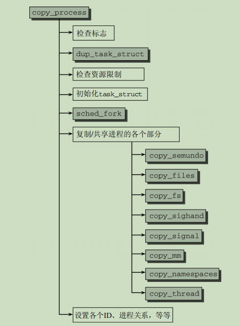

1.检查标志

2.dup_task_struct

3.检查资源限制

4.初始化task_struct

5.sched_fork

6.复制/共享进程的各个部分。

* copy_semundo:
* copy_files:
* copy_fs:
* copy_sighand:
* copy_signal:
* copy_mm:
* copy_namespaces:
* copy_thread:

7.设置各个进程id，进程关系，等等。


1.在复制进程的时候很多参数是无意义的。比如你要请求新命名空间(CLONE_NEWS),并且还要与父进程共享文件系统信息(CLONE_FS). 第一步会检查标识是否合法。


##### 内核线程：

​	是由内核本身启动的进程。将内核函数让独立的进程执行，和其他进程并行执行。也并行于内核自身的执行。

1.周期性的将修改的内存页与页来源块设备同步。

2.如果内存页很少，则写入交换区。

3.管理延时动作。

一般分为两种：

1.线程启动时一直等待，直到内核请求线程做出某一动作。

2.线程启动后，周期性间隔运行，检测特定资源的使用，在用量超过或者低于预期时执行某一动作。


##### 启动新程序：


```c
//kernel/exec.c 
int do_execve(char * filename, 
char __user *__user *argv, 
char __user *__user *envp, 
struct pt_regs * regs)
```


##### 退出程序：

进程必须用exit系统调用终止。这使得内核有机会将该进程使用的资源释放回系统。

该调用的入口点是sys_exit函数，需要一个错误码作为其参数，以便退出进程。

其定义是体系结构无关的，见kernel/exit.c。我们对其实现没什么兴趣，因为它很快将工作委托给do_exit。
简而言之，该函数的实现就是将各个引用计数器减1，如果引用计数器归0而没有进程再使用对应的结构，那么将相应的内存区域返还给内存管理模块。


### 二、调度器的实现

分为两部分：1.调度策略 2.上下文的切换。


实时进程：需要立即响应的进程。（完全公平调度器。暂不讨论此进程）

完全公平调度器只考虑进程的等待时间，即进程在就绪队列（run-queue）中已经等待了多长时间。对CPU时间需求最严格的进程被调度执行。

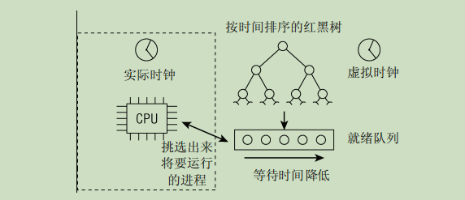


所有的可运行进程都按时间在一个红黑树中排序，所谓时间即其等待时间。

虚拟时钟：


1.周期性检测是否需要切换进程。

2.程序主动放弃cpu。

上述两个组件叫通用调度器（也叫核心调度器）


调度器类用来进行选择下来是哪一个进程执行。（根据调度策略来决定：完全公平调度、实时调度、空闲时调度空闲进程）

在调度器被调用时，它会查询调度器类，查看下一个执行的是哪个进程。

每个进程属于某一个调度类，各个调度类管理所属的进程，通过调度器完全不涉及进程管理，其工作都委托给调度器类。


# 内存

## 内存寻址

逻辑地址：由16位段选择符和32位偏移量组成。

线性地址（虚拟地址）：

物理地址：


内存管理单元(mmu)通过分段单元的硬件店里把一个逻辑地址转换成线性地址。

再通过分页单元的硬件电路把线性地址转换成一个物理地址。


多处理器：

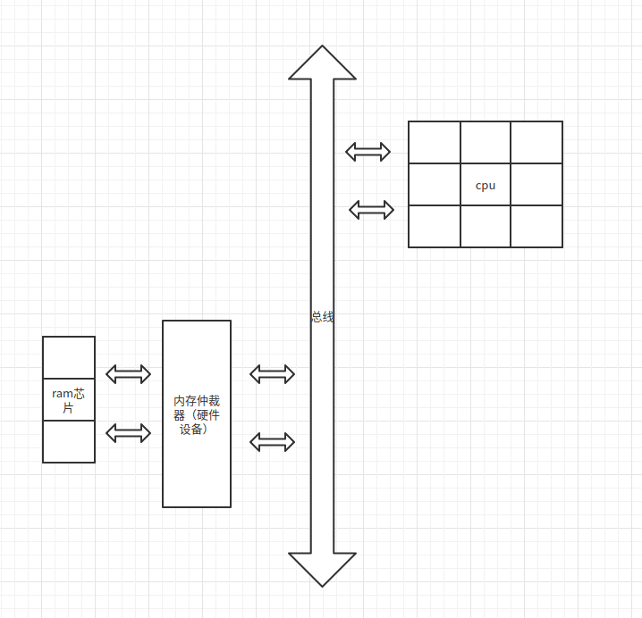

单处理器：

​	dma(直接内存访问)


## 硬件中的分段

段描述符：

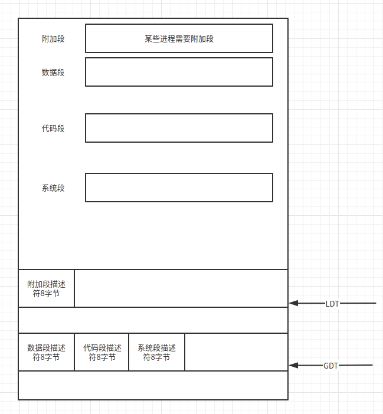


分段：可以给每一个进程分配不同的线性地址空间。

分页：可以把同一线性地址空间映射到不同的物理空间。


用户态：

​	linux进程都使用一对相同的段对指令和数据寻址。这两个段就是用户代码段和用户数据段。

内核态：

​	运行在内核态的linux进程都使用一对相同的段对指令和数据寻址。他们分别叫做内核代码段和内核数据段。

## linux中的分段


## 硬件中的分页

页（page）：

​	为了效率，线性地址被分成以固定长度为单位的组，称为页。

​	页内部连续的线性地址被映射到连续的物理地址中。

​	既指一组线性地址，又指包含在这组地址中的数据。

页框（page frame）：

​	分页单元把所有的RAM(内存)分成固定长度的页框（也叫物理页）。

​	每个页框包含一个页，也就是说一个页框的长度与一个页的长度一致。

页表（page table）：

​	把线性地址映射到物理地址的数据结构称为页表。

​	页表存放在主存中。

​	并在启动分页单元之前必须由内核对页表进行适当的初始化。

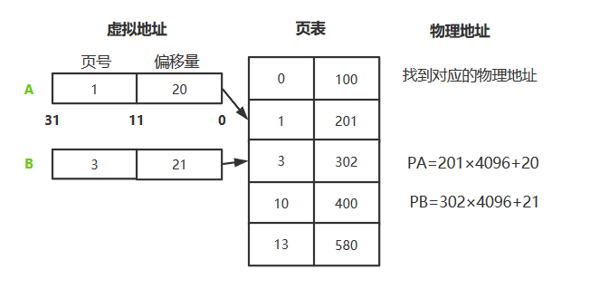

​	

```
页和页框的区别是什么？

页（page）
一页指一系列的线性地址和包含于其中的数据

页框(pageframe)
分页单元认为所有的RAM被分成了固定长度的页框
每个页框可以包含一页，也就是说一个页框的长度和一个页的长度是一样的
页框是内存的一部分，是一个实际的存储区域。
页只是一组数据块，可以存放在任何页框中

也就是说页对应的是线性地址的东西 而页框对应的是物理地址 是实际的存储区域
```


## linux中的分页


区（zone）：


低端内存:

​	存在与内核空间上的逻辑地址内存.几乎所有现在遇到的系统,它全部的内存都是低端内存.

高端内存:

​	是指那些不存在逻辑地址的内存,这是因为他们处于内核虚拟地址之上.


## 段页式内存管理

`内存分段`跟`内存分页`不是对立的，这俩可以组合起来在同一个系统中使用的，那么组合起来后通常称为`段页式内存管理`。段页式内存管理实现的方式：

1. 先对数据不同划分出不同的段，也就是前面说的分段机制。
2. 然后再把每一个段进行分页操作，也就是前面说的分页机制。
3. 此时 地址结构 = 段号 + 段内页号 + 页内位移。

每一个进程有一张段表，每个段又建立一张页表，段表中的地址是页表的起始地址，而页表中的地址则为某页的物理页号。


# 文件系统

/proc/filesystems 中看到所有注册到内核的所有文件系统


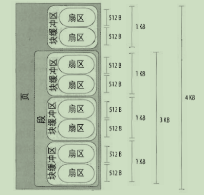

## VFS虚拟文件系统


### 超级块对象:(superblock object)

​	有两种类型：1.存在于磁盘上的超级块。 2.存在于内核内存的超级块。

​	vfs可以屏蔽文件系统的差别就是因为从硬盘上读取特定的内容，然后经过特定文件系统的模块代码将硬盘超级块信息进行整理重组后写入vfs超级块中，inode同理。

​	存放已安装文件系统的有关信息.

​	对基于磁盘的文件系统,这类对象通常对应于存放在磁盘上的文件系统控制块.

​	存储一个已安装的文件系统的控制信息，代表一个已安装的文件系统；

​	每次一个实际的文件系统被安装时， 内核会从磁盘的特定位置读取一些控制信息来填充内存中的超级块对象

​	一个安装实例和一个超级块对象一一对应。 超级块通过其结构中的一个域s_type记录它所属的文件系统类型。


### 索引节点对象:(inode object)

​	有两种类型：1.存在于磁盘上的索引节点。 2.存在于内核内存的索引节点。

​	vfs可以屏蔽文件系统的差别就是因为从硬盘上读取inode的内容，然后经过特定文件系统的模块代码将硬盘inode信息读取后进行整理重组写入vfs的inode中。

文件:	

​	存放关于具体文件的一般信息,也叫文件的元数据.例如:访问权限,访问时间,修改时间等.

​	对基于磁盘的文件系统,这类对象通常对应于存放在磁盘上的文件控制块(也就是实际文件内容的数据段).

​	每个索引节点对象都有一个索引节点号,这个节点号唯一的标识文件系统中的文件.

​	索引节点仅当文件被访问时，才在内存中创建。

​	可以是特殊文件，管道，或者是设备这样的文件，Inode中有专门的共用体类型指向特殊文件。

​	有些文件系统可能不能完整的包含Inode所有的内容，该文件系统就可以在实现中选择任意办法来解决这个问题，可以将该项置空，或者只在内存中修改，而不写入磁盘中，都可以由文件系统的实现者来决定。

目录:

​	文件查找起始于根目录/,对系统来说是已知的. 

​	根目录由一个inode表示,但是inode数据段并不包含普通数据,而是根目录下的各个目录项.

​	目录项有两个成员:1.该目录项的数据所在inode编号.2.文件或目录的名称.


### 文件对象:(file object)

​	存放打开文件与进程之间进行交互的有关信息.

​	这类信息仅当进程访问文件期间存在于内核内存中.

​	


### 目录项对象(dentry object)

​	该项只存在与内存中。叫目录项缓存。

​	VFS根据字符串形式的路径名，现场创建它。

​	存放目录项(文件的特定名称)与对应文件进行链接的有关信息.

​	dentry结构的主要用途是建立文件名和相关的inode之间的关联。

​	


### 链接(link):

​	用于建立文件系统对象之间的联系,这不符合经典的树状模型.

​	有两种类型:符号链接, 硬链接.

​	符号链接: 认为是方向指针,表示文件存在与特定的位置.  有时使用软连接来表示.    可以认为是一个目录项,其中除了指向文件名的指针,并不存在其他数据.     目标文件删除时,符号链接依然存在.      每个符号链接都有一个独立的inode.相应inode的数据段包含一个目标路径的一个字符串.

​	硬链接: 


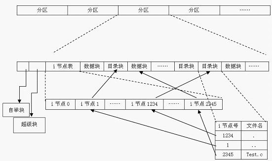


```c
/**
 * inode_hashtable: 表的初始化,文件在/fs/inode.c
*/
void __init inode_init(void)：
```


## 块缓存

​	文件系统以块的方式来组织文件，一般为2扇区，4扇区。

​	文件系统的组织方式，要求提供一种块缓存机制来暂存文件的内容，因此内核提供了buffer_head管理结构来管理块缓存。

#### buffer_head

​	buffer_head本身并没有保存文件内容，文件内容实际还是在page cache中.

​	buffer_head是个管理结构，它只是标识文件块的序号以及文件块缓存的地址。

​	buffer_head提供对底层硬件设备（块设备）的映射。


#### address_space

​	内核通过address_space来管理page cache。这个结构提供一个radix tree成员。

​	文件内容缓存页保存在这个radix tree里面。


## 页高速缓存

页高速缓存（cache）：是linux内核用来实现磁盘缓存，减少对磁盘i/o操作。

临时局部原理：数据一旦被访问，就很可能在短期内再次被访问到。

可以动态调整大小：可以占用空闲内存进行扩张，也可以自我收缩缓解内存压力。

内核进行读操作时，首先检查需要的数据是否在页高速缓存中，如果在，则放弃访问磁盘，直接从缓存中读取，这个行为称作缓存命中。如果不在，则需要调度块io操作从磁盘读取数据，后放入页缓存中。称为未命中。

并不一定将整个文件放入缓存。 可以存储一些文件的一页或者几页。

该缓存谁取决于谁被访问到。

### 缓存手段

#### 写缓存手段

1.不缓存。（nowrite）。

2.写透缓存（write-through cache）。

3.回写。

回写也是linux采用的，写操作先写到缓存中，将页缓存中被写入的页面标记成“脏”，并加入到脏页链表中，由回写进程周期性将脏页链表中的页写回到磁盘。


#### 缓存回收策略

（缓存中数据如何清除，为更重要缓存腾出位置，收缩缓存大小）

1.优先回收干净可用页。

2.没有干净页，进行强制回写操作。（但什么页优先进行回写呢）--->预测算法。


预测算法1：最近最少使用算法（LRU）

预测算法2：双链策略。或多链策略。（LRU/2,LRU/n）。


#### 缓存查找策略

基数树(radix tree)


### 高速缓冲区：

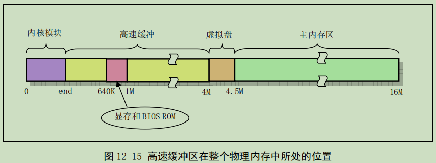

​	1高速缓冲区在块设备与内核其他程序之间起一个桥梁作用。		

​	2除了块设备驱动程序之外，内核程序如果需要访问块设备中的数据，就都需要经过高速缓冲区来间接的操作。


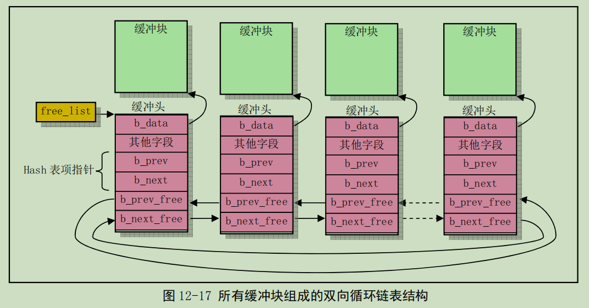


​	当一个块被调入内存时（也就是在读入后或等待写出时），她要存储在一个缓冲区中。

​	每个缓冲区与一个块对应，相当于磁盘块在内存中的表示。

​	块包含一个或多个扇区，但不能超过一个页，所有一个页可以容纳多个块。

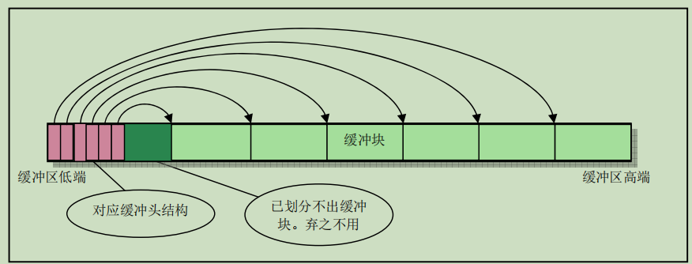


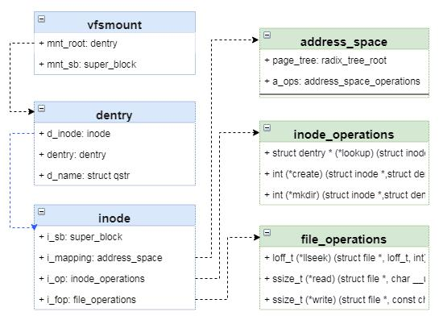


### 地址空间对象(address space object)：


sysfs文件系统：

目的：展现设备驱动程序模型组件间的层次关系。

block:块设备，他们独立于所链接的总线。


# 进程

 rest_init函数中，创建1号进程。

 第一处pid = kernel_thread(kernel_init, NULL, CLONE_FS);即会创建1号进程init 

 第二处pid = kernel_thread(kthreadd, NULL, CLONE_FS | CLONE_FILES);即会创建2号进程kthreadd 


 kernel_init 功能：查找文件系统提供的init进程。

```
if (!try_to_run_init_process("/sbin/init") ||

!try_to_run_init_process("/etc/init") ||

!try_to_run_init_process("/bin/init") ||

!try_to_run_init_process("/bin/sh"))
```

kthreadd功能： 不断从全局链表kthread_create_list中获取一个节点，然后执行节点中的函数，这样就可以做到管理调度其它内核线程的功能 


