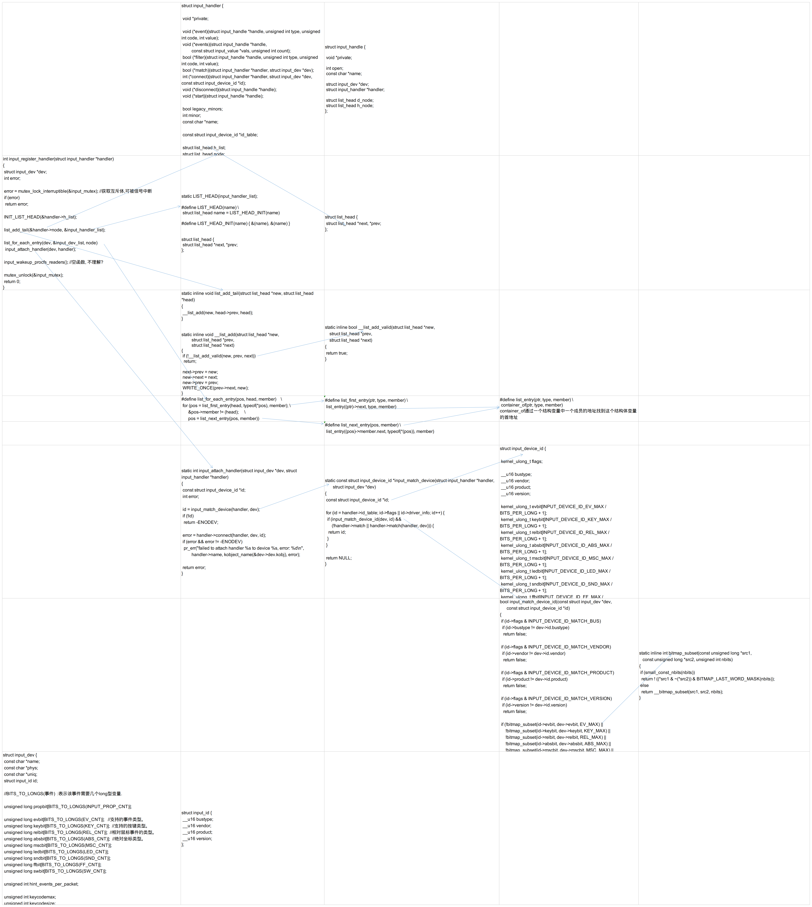
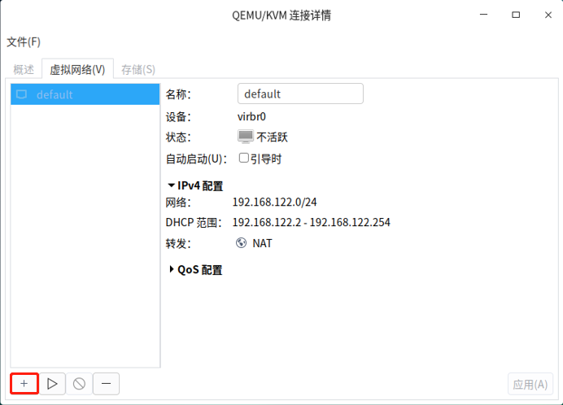
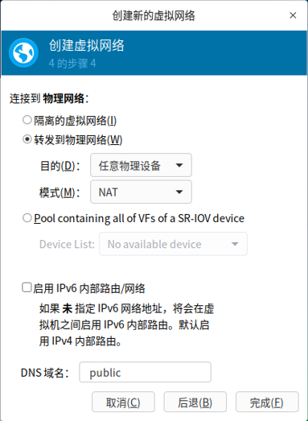
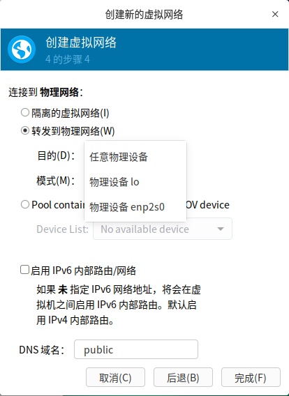

# 目录

[TOC]

# ===================

# 哲学

​	佛教认为，没有任何人和神的精心策划，因缘和合的时候，一切就会出现，不需要任何神和鬼的干预。一切都是因缘的结果，一切都是自己掌控，来世的去向与境遇，都是自己创造的，不受任何鬼神的摆布，自己的未来自己决定，自己的命运自己创造。佛陀反反复复地讲，“我为汝说解脱法，解脱依己当精进。”佛陀从来没有自命为救世主，一切都靠自己。运气好不好、身体好不好，都是靠自己。


# ===================

# 扫盲

## 1.实模式

CPU[复位](https://baike.baidu.com/item/复位/6156307)（reset）或加电（power on）的时候以实模式启动，处理器以实模式工作。在实模式下，内存寻址方式和8086相同，由16位段寄存器的内容乘以16（10H）当做段基地址，加上16位[偏移地址](https://baike.baidu.com/item/偏移地址/3108819)形成20位的物理地址，最大寻址空间1MB，最大分段64KB。可以使用32位指令。32位的x86 CPU用做高速的8086。在实模式下，所有的段都是可以读、写和可执行的。

## 2.Kconfig基本语法

menu <名字>  : 菜单的主目录.  目录名为后边的名字. 

```Kconfig
config 配置名:
	tristate "二级显示的信息"			#tristate为消息类型,menu下二级目录显示的信息.  也可为bool. 
	default y						 #默认选择.
	depends on A && B 	             #基于A模块和B模块,必须选择基准模块,才能显示该选项.
	select C					     #若选择该模块,则C模块也被选中.
```

数据类型介绍:

bool变量的值：   y和n

tristate变量的值： y、n和m

string变量的值：  字符串


## 3.内核地图:Kconfig和Makefile查找对应模块代码

## 4./dev,sysfs和/proc虚拟文件系统介绍

### 1.sysfs: 

sysfs是一个特殊的文件系统, 类似/proc, sysfs不仅像/proc一个允许用户空间访问内核的数据, 而且更结构化的方式向用户提供内核数据信息. sysfs是一种内存文件系统,它和kobject(内核对象)关系非常亲密.系统中的每一个kobject对应着sysfs中的一个目录,而每一个sysfs中的目录代表一个kobject对象,每个sysfs文件代表对应的kobject的属性.

   sysfs文件系统非常清晰的展示了设备驱动程序模型中各组件的层次关系. 其顶级目录包括block,device,bus,drivers,class,power,firmware等.


### 2. /proc:

Linux内核中的/proc文件系统是一种特殊的文件系统, 通过它可以在运行时访问内核的内部数据结构,改变内核设置,内核可以通过它向进程发送信息.应用程序可以通过/proc文件系统获取有关进程的有用信息,Linux中的ps,top命令就是通过读取/proc下的文件来获取它们需要的信息. 与其他文件系统不同,/proc主要存放由内核控制的状态信息,它存储于内存中而不是硬盘或其他存储设备上. /proc文件系统的根目录就是/proc. 对于系统中的任何一个进程来说,在proc的子目录都有一个同名的进程ID. 利用/proc文件系统可以获取进程信息,电源管理(APM)信息,CPU信息(cpuinfo),负载信息(loadavg),系统内存信息(meminfo)等等. 

### 3. /dev

设备文件目录

## 5.centos切换开机图形界面和控制台界面

CentOS7开机不进入图形界面设置
和cent6系列不同的是，不再是直接改文件中的5就可以了。

systemctl get-default  //获取当前的默认target

systemctl set-default multi-user.target
设置当前的target,可选值有graphical.target,multi-user.target，multi_user.target就是开机不进入图形界面的多用户模式。

## 6.多核和多处理器的区别：

多核：每个cpu共用一套cache和mmu

多处理器：每个cpu有自己的一套cache和mmu

# ===================

# 操作系统（李治军）

课程地址:https://www.icourse163.org/learn/HIT-1002531008?tid=1450346461&from=study#/learn/content?type=detail&id=1214728532&cid=1218670721


# ===================


# X86汇编从实模式到保护模式


Intel 8086 在实模式下可以访问 1MB 的内存空间，地址范围为 0x00000 到 0xFFFFF。

出于各方面的考虑，计算机系统的设计者将这 1MB 的内存空间从物理上分为几个部分。
8086 有 20 根地址线，但并非全都用来访问 DRAM，也就是内存条。事实上，这些地址
线经过分配，大部分用于访问 DRAM，剩余的部分给了只读存储器 ROM 和外围的板卡.

1.0x00000-0x9FFFF:DRAM(动态随机访问存储器):

2.0xA0000-0xEFFFF:   分给外围设备

3.0xF0000-0xFFFFF:ROM(只读存储器),占据内存顶端的64k空间. 固化了开机时要执行的指令


0xB8000～0xBFFFF : 分给显卡的.

8086加电或复位时,cs=0xffff,ip=0x0000,位于rom处,开始执行bios程序. 

物理地址为0xFFFF0, 到最后结束也只有16个字节.所以一般为一个jmp指令.

处理器取指令执行的自然顺序是从内存的低地址向高地址推进.

# ===================

# Linux内核设计的艺术

intel8086系列的cpu可以分别在16位实模式和32位保护模式下运行。为了兼容intel将所有80x86系列cpu都设计为上电既进入16位实模式状态运行。并将cs值置为：0xffff    ip值置为：0x0000.这样cs:ip指向0xffff0

Intel 8086 在16位实模式下可以访问 1MB 的内存空间，地址范围为 0x00000 到 0xFFFFF。

16位实模式下，有20位地址总线，所有可以访问1mb的地址空间。

出于各方面的考虑，计算机系统的设计者将这 1MB 的内存空间从物理上分为几个部分。
8086 有 20 根地址线，但并非全都用来访问 DRAM，也就是内存条。事实上，这些地址
线经过分配，大部分用于访问 DRAM，剩余的部分给了只读存储器 ROM 和外围的板卡.

1.0x00000-0x9FFFF:DRAM(动态随机访问存储器):

2.0xA0000-0xEFFFF:   分给外围设备

3.0xF0000-0xFFFFF: ROM(只读存储器),占据内存顶端的64k空间. 固化了开机时要执行的指令


0xB8000～0xBFFFF : 分给显卡的.

8086加电或复位时,cs=0xffff,ip=0x0000,位于rom处,开始执行bios程序. 

物理地址为0xFFFF0, 到最后结束也只有16个字节.所以一般为一个jmp指令.

处理器取指令执行的自然顺序是从内存的低地址向高地址推进.


## 1.linux0.11启动流程分析

### 1.1 初始化阶段/boot/中的汇编代码

1.bios入口地址为0xffff0，bios的第一条指令就设计在这个位置上。

2.bios检测显卡内存，并在内存中建立中断向量表和中断服务程序。

中断向量表：0x00000~0x003ff，1kb的内存空间。并在紧挨着他的位置用256字节构建bios数据区：0x00400~0x004ff，在大约56kb以后的位置(0x0x0e2ce)，加载了8kb左右的与中断向量表相对应的中断服务程序。

3.bios调用0x19中断服务程序(启动加载服务程序)将启动盘的第一个扇区512b读入到内存0x7c00处。这个512b的程序就是启动扇区。就是linux0.11代码中bootsect.s汇编而成的。

4.在bootsect.s中,start.执行将0x7c00处的代码(也就是自己)复制到0x9000处.   然后跳转到新地址中的go标记继续执行.

```asm
; 刘十三
; 1.将要加载的setup程序的扇区数(SETUPLEN),和被加载到的位置(SETUPSEG)
; 启动扇区被bios加载的位置(BOOTSEG),和将要移动到的新位置(INITSEG)
; 内核被加载的位置(SYSSEG),内核的末尾位置(ENDSEG)
; 根文件系统设备号(ROOT_DEV)
entry start
start:
	mov	ax,#BOOTSEG
	mov	ds,ax
	mov	ax,#INITSEG
	mov	es,ax
	mov	cx,#256
	sub	si,si
	sub	di,di
	rep
	movw				
	; 从start到这行, bootsect将自身从内存0x7c00处拷贝到0x9000处.
```

5.初始化栈寄存器，就可使用push和pop操作， 压栈方向从高地址到低地址。

```assembly
;  刘十三:
;  2.对DS(数据段寄存器) ES(附加段寄存器) SS(栈基址寄存器) 设置成0x9000, 并将sp(栈顶指针)指向0xff00处.
;  对这几个寄存器的设置,就可以在后边使用push和pop操作。
go:	mov	ax,cs
	mov	ds,ax
	mov	es,ax
;  put stack at 0x9ff00.
	mov	ss,ax
	mov	sp,#0xFF00		;  arbitrary value >>512
```

6.调用0x13中断，将软盘从第2扇区开始的4个扇区（2~5扇区），既setup.s对应的程序加载到0x90200处，紧挨着启动扇区。

```assembly
load_setup:
	mov	dx,#0x0000		;  drive 0, head 0
	mov	cx,#0x0002		;  sector 2, track 0
	mov	bx,#0x0200		;  address = 512, in INITSEG
	mov	ax,#0x0200+SETUPLEN	;  service 2, nr of sectors
	int	0x13			;  read it
	jnc	ok_load_setup		;  ok - continue
	mov	dx,#0x0000
	mov	ax,#0x0000		;  reset the diskette
	int	0x13
	j	load_setup
```

7.调用0x13中断，将system模块加载到内存。

​	system模块有240个扇区，然后跳转到0x90200处执行。

8.setup.s开始运行，提取内核运行需要的机器系统数据。

从0x41和0x46的中断向量函数中获取硬盘参数表1和硬盘参数表2并分别放在0x9000:0x0080和0x9000:0x0090处。  大约占用内存0x90000~0x901fc. 覆盖了原来的bootsect程序，只剩余2字节未被覆盖。 后续main函数执行时，需要用到这里边的机器系统数据。

9.


未完待续，汇编太多，看不下去了。


### 1.2 从main到怠速状态


### 系统调用

1.系统调用号:  对应相应的系统调用。


# ===================


# 嵌入式开发（JZ2440开发版）

教程地址：https://www.bilibili.com/video/BV1EW411L7RE?p=13

1.线的链接和驱动的安装

2.eop烧写裸版


# ===================

# 系统调用

## 1.Linux的系统调用

​	对于现代操作系统，系统调用是一种内核与用户空间通讯的普遍手段，Linux系统也不例外。

​	但是Linux系统的系统调用相比很多Unix和windows等系统具有一些独特之处，无处不体现出Linux的设计精髓——简洁和高效。
​	Linux系统调用很多地方继承了Unix的系统调用（但不是全部），但Linux相比传统Unix的系统调用做了很多扬弃，它省去了许多Unix系统冗余的系统调用，仅仅保留了最基本和最有用的系统调用，所以Linux全部系统调用只有400个左右（而有些操作系统系统调用多达1000个以上）。
​	这些系统调用按照功能逻辑大致可分为“进程控制”、“文件系统控制”、“系统控制”、“存储管理”、“网络管理”、“socket控制”、“用户管理”、“进程间通信”等几类，详细情况可参阅文章系统调用列表
如果你想详细看看系统调用的说明，可以使用man 2 syscalls 命令查看，或干脆到 <内核源码目录>/include/asm-i386/unistd.h源文件中找到它们的源本。

## 2.系统调用的功能：

* 控制硬件——系统调用往往作为硬件资源和用户空间的抽象接口，比如读写文件时用到的write/read调用。
* 设置系统状态或读取内核数据——因为系统调用是用户空间和内核的唯一通讯手段，所以用户设置系统状态，比如开/关某项内核服务（设置某个内核变量），或读取内核数据都必须通过系统调用。比如getpgid、getpriority、setpriority、sethostname
* 进程管理——一系统调用接口是用来保证系统中进程能以多任务在虚拟内存环境下得以运行。比如 fork、clone、execve、exit等

## 3.系统调用的实现


# ===================


# 网络子系统


# ===================


# Linux系统层次结构

一个完整的Linux发行版本大概可以分为以下四个层次结构:

Base System => X Protocol => Windows Manager => Application

如下图所示：

## **1. Base System**

  所谓Base System，也就是一个最小的基本系统，需要包含一些系统必备的开源组件，比如：kernel, filesystem, glibc, bash等。

  这个最小系统最终能达到的层次就是能够启动我们的命令行字符控制终端，也就是一个bash环境，这样一个最小系统可以精简、控制在几十M的大小以内。


## **2. X Protocol**

当我们构建完了最小的基本系统以后，这样一个系统只支持命令行字符终端模式，而无法支持图形化界面，如果想要使我们的Linux系统能够支持图形化界面，必须要有X Protocol的支持，基于这样的一个X协议，就可以在最小系统的层次上，构建Linux的窗口管理器。

X Protocol仅仅只是一个协议，对于这样一个协议，具体是由什么来实现的呢？在Linux早期的时候，是通过XFree86来实现X协议，经过多年的发展，XFree86已经更替为今天的X.Org项目。

不管是XFree86,  还是现在的X.Org，在实现X协议的时候，都是基于C/S架构，也就是X Server 和 X Client 的交互模式。关于X Server 和 X Client  之间的关系，在接下来的一节中将详细介绍。在这里大家只需明确：如果我们需要支持图形化界面，就需要有X相关的组件来作为一个沟通的桥梁。

当然，X 并不是唯一的桥梁，有像Wayland这样的新生替代品也已经面世，只是目前尚不成熟，也许在未来的某一天，Wayland将会全面代替现在的 X。


## **3. Windows Manager**

有了X层的支持以后，广大开源软件开发者或开发组织，就可以基于这样的一个接口，来开发上层的图形化窗口管理器，即Windows Manager, 比如我们熟知的KDE，Gnome， Xfce， Openbox等，这些图形化的桌面环境也就是对上面提到的X  Client的一个具体实现，来和 X Server进行交互通信。

在一下章节中，将具体讲解X Server, X Client， Xlib， QT， GTK， KDE， Gnome之间的关系。


## **4. Application**

Application也就是指我们的上层图形化应用程序，比如 Liberoffice办公套件，Firefox，Thunderbird，Pidgin等。

Linux系统中的大多数图形化应用程序都是基于QT或GTK+这两个开发套件来开发的，当然也有像Java， Python等编写的应用程序。


# ===================

# x86架构linux内核启动过程

参考博客:https://blog.csdn.net/GerryLee93/article/details/106474310

机器启动到linux初始化是一个比较复杂并且细节性较强的过程，大部分的实现都是由于历史遗留问题以及各种协议约定而来的，衔接性比较强，而且比较难跟踪，毕竟不是C语言那么简单，一个函数调用一个函数，整个脉络比较清晰明了。

这里主要是以linux-3.2.55版本内核为基础，将整个系统的初始化流程梳理了一下。

A、自摁下电源开关后，是由主板自动初始化处理器信息的，将CS、DS、ES、SS置为0xffff，而PC置为0x0000，由于初始化时，处理器处于实模式，那么也就是计算机执行的第一条指令在0xffff0这个位置。计算机执行的第一条指令是来自BIOS的，存储在ROM里面，通过ROM芯片译码以读取出来执行，该指令通常都是一条跳转指令，这是由于0xffff0距离可访问的内存结尾已经不远了，该指令可以用来跳转到具体的BIOS操作代码中；

B、BIOS开始执行后，做了不少事情，比如Power On Self Test（POST，开机自检），检查CPU寄存器、周边芯片的状态，以及针对动态内存、主板芯片组、显卡以及相关外围的寄存器做初始化设置，并检查能够正常工作，同时记录系统的设置值，最重要的就是将常驻程序库（可以理解为BIOS的库，基本上就是中断）放置在某段内存中，提供给操作系统或者应用程序调用，比如int 0x13等；

C、BIOS毕竟不是系统，完成了分内工作后，执行int 0x19（前面提到的BIOS的常驻程序库）将存储在磁盘0头0道1扇区的MBR读入到内存0x7c00中，然后BIOS通过跳转指令去到0x7c00去执行引导程序代码；

D、MBR的引导程序对不同的linux版本而言各有不同，最初0.11版本中，linux的/boot/bootsect.s自己实现了这个MBR引导程序，而如今3.2.55的linux内核版本自身已经不再实现MBR引导程序了，都是由GRUB的/stage1/stage1.S实现的，具体的引导程序历史可以参考linux内核中的/Documentation/x86/boot.txt；

E、Linux 0.11的引导过程就不谈了，关于这块的资料数不胜数，那么GRUB实现的引导，主要是给用户提供了系统引导选择和引导编辑等功能，核心的是它通过调用BIOS的常驻程序库去将linux内核映像加载到内存当中；

F、GRUB加载完了内核映像，将会跳转到内核的文件/arch/x86/boot/header.S里面的_start开始执行，其实_start也没什么好执行的，就跳转到start_of_setup去设置准备给实模式下main函数运行的环境；

G、开始进入main函数执行，该函数的实现在文件/arch/x86/boot/main.c里面，具体可以进入去分析里面的代码，其主要的莫过于一些参数的准备、堆的初始化、CPU的检测、BIOS的设置以及内存检测等工作（这里使用了一些BIOS中断，所以这些都是在实模式下的！！！），然后开始转入保护模式；

H、进入保护模式后，将会跳转去执行arch/x86/boot/compressed/head_32.S里面的startup_32，其主要设置一个基本的环境，如堆栈等；

I、再往下就是调用文件/arch/x86/boot/compressed/misc.c里面的decompress_kernel，用来解压内核，当内核被解压到内存中之后，就可以调用它了；

J、解压完内核，还要调用一个startup_32，这个不同于前面的那个，这个是位于文件/arch/x86/kernel/head_32.S里面的，主要工作是对页表进行初始化，并启动内存分页功能，初始化0号进程；

K、startup_32执行完了之后，最后进入内核的主题函数start_kernel，该函数位于文件/init/main.c，自此完成linux的最后初始化。

以上就是机器启动linux的整个过程，主要是梳理了初始化实现的一个线索，暂时不深入分析。


# ===================

# input子系统

​    输入输出是用户和产品交互的手段，因此输入驱动开发在Linux驱动开发中很常见。同时，input子系统的分层架构思想在Linux驱动设计中极具代表性和先进性，因此对Linux input子系统进行深入分析很有意义。

## 1.Linux如何查看所有注册的输入子系统

### 1. /dev/input目录

/dev/input目录下的事件都是在驱动中调用input_register_device(struct input_dev *dev)产生的。

如我的uos中显示：


### 2. 与event对应的设备信息。

位于/proc/bus/input/devices,例子如下:

### 3. 写测试程序读取鼠标和键盘的上报信息。

代码如下：

```c
#include <linux/input.h>
#include <unistd.h>
#include <sys/types.h>
#include <sys/stat.h>
#include <fcntl.h>
#include <stdio.h>
//具体哪个event要通过设备信息来看。
#define  INPUT_MOUSE    "/dev/input/event6"    /* 我电脑的鼠标*/
#define  INPUT_KEY      "/dev/input/event1"    
#define  INPUT_MOUSE1     "/dev/input/mouse0"   
int main(void)
{
    int fd = -1, ret = -1;
    struct input_event ev;
    fd = open(INPUT_MOUSE , O_RDONLY);    /* 打开鼠标的设备文件 */
    if(fd < 0)
    {
        perror("open");
        return -1;
    }
    while(1)
    {
        memset(&ev, 0, sizeof(struct input_event));    
        ret = read(fd, &ev, sizeof(struct input_event));    /* 读鼠标（会阻塞） */
        if(ret != sizeof(struct input_event))
        {
            perror("read");
            close(fd);
            return -1;
        }
        /* 打印读到的键值 */
        printf("--------------------\n");
        printf("type = %u.\n", ev.type);
        printf("code = %u.\n", ev.code);
        printf("value = %u.\n", ev.value);
    }
    return 0;
}
```

执行效果：鼠标移动就会打印数据。 


### 4.字符设备和input子系统处理流程对比

input子系统本质: 将字符设备驱动进行封装.

字符设备(按键举例):中断触发->延后机制->字符设备->文件操作接口->提供给应用层

input子系统(按键举例) :中断触发->延后机制->input子系统专用的API函数->提供给应用层

## 2. input子系统结构图

input子系统由下面3部分组成:

驱动层(Drivers)

输入子系统核心层(Input Core)

事件处理层(Event Handler)


## 3. input子系统介绍

Linux input  子系统将一个输入设备的输入过程分成了设备驱动(input device driver)和事件驱动（input  event  driver）两个层。前者负责从底层硬件采集数据；后者负责与用户程序接口，将采集到的数据分发给不同的用户接口。通过这样的设计，将千差万别的设备统一到了为数不多的几种驱动接口上。同一种事件驱动可以用来处理多个同类设备；同一个设备也可以和多种事件驱动相衔接。而事件驱动和设备驱动则由输入核心层进行连接，匹配。而事件驱动是系统已经定义好的, 再写设备驱动时需要哪种类型的事件驱动就去做匹配就可以了. 

**设备驱动(input device driver)**:    

​		自己写的,比如 drivers/hid/usbhid/usbmouse.c

**事件驱动(input  event  driver)**:	

​		系统已经开发好了 drivers/input/evdev.c

​		专门处理输入设备产生的按键(Event)事件: evdev

​		鼠标事件:mousedev

上：输入事件驱动层         （打包数据，面向应用）

中：输入核心层                 （向下提供注册接口，向上给具体的hander发送数据）

下：输入设备驱动层         （底层驱动，面向硬件）    


## 4. input子系统工作过程

以鼠标按键为例说明input子系统的工作过程：

鼠标按下－＞出发中断（中断是已经注册好的）－＞中断处理函数－＞在函数中就会读硬件寄存器来判断按下的是哪个按键和状态－＞将按键信息上报给input core层－＞input core层处理完成后会上报给input event层，input event层会将我们的输入事件封装成一个input_event结构体放入一个缓冲区中－＞应用层read就会将将缓冲区中的数据读取出去．

## 5.重要结构

**Input_device**: 代表着具体的输入设备，它直接从硬件中读取数据，并以事件的形式转发

**Hanler**: 代表接收某一类事件的上层接口，对应于一类事件设备文件

**Handle** : 用于将input_device 和 handler 连接起来，对应于某1个具体的设备文件

**Client**: 对应于用户程序对文件的访问接口，每open一次事件驱动，就创建一个client


input子系统的核心层维护着两条链表

```c
static LIST_HEAD(input_dev_list);         //记录所有的输入设备
static LIST_HEAD(input_handler_list);     //记录所有的事件驱动
```

每当有新设备或者新的事件驱动被系统加载(调用input_register_device()或者input_register_driver()),都会扫描整个链表，并调用函数input_match_device(struct input_handler *handler, struct input_dev *dev)尝试配对工作．input_handler->id_table记录了需要匹配的特征．

id_table中有bitmap来控制匹配.


## 6.事件驱动

事件驱动注册程序分析：



## 7.设备驱动

## 8.输入子系统核心层


# ===================

# pipe管道内核源码分析

## 1.代码中出现的语法层面分析

* 1.__cplusplus

```c
#ifdef __cplusplus  　　//该字段是c++编译器中特有的,用来区分编译器是gcc还是g++
#define CPP_ASMLINKAGE extern "C"
#else
#define CPP_ASMLINKAGE
#endif
```

* 2.SYSCALL_DEFINE*宏定义介绍

表示宏内定义的函数为系统调用，*处所写的数字代表的是该系统调用所使用的参数个数。

系统调用的具体用法请看第八章－>自定义系统调用。

* 3.fs_initcall(init_pipe_fs);

  给系统内核添加一个功能函数。　　个人理解：文件系统类模块的初始化函数。

* 4.struct inode

  inode是VFS使用的一个对象，用于存放内核在操作文件或目录时所需要的全部信息。

## 2.代码分析

* 1.入口函数

```c
SYSCALL_DEFINE2(pipe2, int __user *, fildes, int, flags)
{
	return do_pipe2(fildes, flags);
}

SYSCALL_DEFINE1(pipe, int __user *, fildes)
{
	return do_pipe2(fildes, 0);
}
```

# ===================

# UOS上使用KVM安装一个linux系统

## 1.KVM安装虚拟机的使用

### 一、安装

安装命令：

```shell
sudo apt -y install libvirt0 libvirt-daemon qemu virt-manager bridge-utils libvirt-clients python-libvirt qemu-efi uml-utilities virtinst qemu-system
```

### 二、打开


### 三、网络设置

编辑->连接详情->虚拟网络

default 是KVM安装时默认创建的虚拟网络







在步骤4中的网络模式：

* 隔离的虚拟网络->Host Only：

* 转发到物理网络：
  * 目的：默认即可，通过本主机网卡转发
  * 模式：NAT、路由、Open

* SR-IOV ：技术是一种基于硬件的虚拟化解决方案，可提高性能和可伸缩性

### 四、安装虚拟机

新建->加载iso镜像文件->分配资源。 等，和vm差不多，不过多介绍。


# ===================


# ===================

# 计算机是如何启动的?

从打开电源到开始操作，计算机的启动是一个非常复杂的过程。

**0、boot的含义**

先问一个问题，"启动"用英语怎么说？

回答是boot。可是，boot原来的意思是靴子，"启动"与靴子有什么关系呢？ 原来，这里的boot是bootstrap（鞋带）的缩写，它来自一句谚语：拽着鞋带把自己拉起来

必须想尽各种办法，把一小段程序装进内存，然后计算机才能正常运行。所以，工程师们把这个过程叫做"拉鞋带"，久而久之就简称为boot了。

计算机的整个启动过程分成四个阶段。

## **一、第一阶段：BIOS**

上个世纪70年代初，"只读内存"（read-only memory，缩写为ROM）发明，开机程序被刷入ROM芯片，计算机通电后，第一件事就是读取它。

这块芯片里的程序叫做"基本輸出輸入系統"（Basic Input/Output System），简称为[BIOS](http://en.wikipedia.org/wiki/BIOS)。

1.1 硬件自检

BIOS程序首先检查，计算机硬件能否满足运行的基本条件，这叫做"硬件自检"（Power-On Self-Test），缩写为[POST](http://en.wikipedia.org/wiki/Power-on_self-test)。

如果硬件出现问题，主板会发出不同含义的[蜂鸣](http://en.wikipedia.org/wiki/Power-on_self-test#Original_IBM_POST_beep_codes)，启动中止。如果没有问题，屏幕就会显示出CPU、内存、硬盘等信息。

1.2 启动顺序

硬件自检完成后，BIOS把控制权转交给下一阶段的启动程序。

这时，BIOS需要知道，"下一阶段的启动程序"具体存放在哪一个设备。也就是说，BIOS需要有一个外部储存设备的排序，排在前面的设备就是优先转交控制权的设备。这种排序叫做"启动顺序"（Boot Sequence）。

打开BIOS的操作界面，里面有一项就是"设定启动顺序"。

## **二、第二阶段：主引导记录**

BIOS按照"启动顺序"，把控制权转交给排在第一位的储存设备。

这时，计算机读取该设备的第一个扇区，也就是读取最前面的512个字节。如果这512个字节的最后两个字节是0x55和0xAA，表明这个设备可以用于启动；如果不是，表明设备不能用于启动，控制权于是被转交给"启动顺序"中的下一个设备。

这最前面的512个字节，就叫做["主引导记录"](http://en.wikipedia.org/wiki/Master_boot_record)（Master boot record，缩写为MBR）。

**2.1 主引导记录的结构**

"主引导记录"只有512个字节，放不了太多东西。它的主要作用是，告诉计算机到硬盘的哪一个位置去找操作系统。

主引导记录由三个部分组成：

```
　　（1） 第1-446字节：调用操作系统的机器码。

　　（2） 第447-510字节：分区表（Partition table）。

　　（3） 第511-512字节：主引导记录签名（0x55和0xAA）。
```

其中，第二部分"分区表"的作用，是将硬盘分成若干个区。

**2.2 分区表**

硬盘分区有很多[好处](http://en.wikipedia.org/wiki/Disk_partitioning#Benefits_of_multiple_partitions)。考虑到每个区可以安装不同的操作系统，"主引导记录"因此必须知道将控制权转交给哪个区。

分区表的长度只有64个字节，里面又分成四项，每项16个字节。所以，一个硬盘最多只能分四个一级分区，又叫做"主分区"。

每个主分区的16个字节，由6个部分组成：

```
	（1） 第1个字节：如果为0x80，就表示该主分区是激活分区，控制权要转交给这个分区。四个主分区里面只能有一个是激活的。

　　（2） 第2-4个字节：主分区第一个扇区的物理位置（柱面、磁头、扇区号等等）。

　　（3） 第5个字节：主分区类型。

　　（4） 第6-8个字节：主分区最后一个扇区的物理位置。

　　（5） 第9-12字节：该主分区第一个扇区的逻辑地址。

　　（6） 第13-16字节：主分区的扇区总数。
```

最后的四个字节（"主分区的扇区总数"），决定了这个主分区的长度。也就是说，一个主分区的扇区总数最多不超过2的32次方。

如果每个扇区为512个字节，就意味着单个分区最大不超过2TB。再考虑到扇区的逻辑地址也是32位，所以单个硬盘可利用的空间最大也不超过2TB。如果想使用更大的硬盘，只有2个方法：一是提高每个扇区的字节数，二是[增加扇区总数](http://en.wikipedia.org/wiki/GUID_Partition_Table)。

## **三、第三阶段：硬盘启动**

这时，计算机的控制权就要转交给硬盘的某个分区了，这里又分成三种情况。

**3.1 情况A：卷引导记录**

上一节提到，四个主分区里面，只有一个是激活的。计算机会读取激活分区的第一个扇区，叫做["卷引导记录](http://en.wikipedia.org/wiki/Volume_Boot_Record)"（Volume boot record，缩写为VBR）。

"卷引导记录"的主要作用是，告诉计算机，操作系统在这个分区里的位置。然后，计算机就会加载操作系统了。

**3.2 情况B：扩展分区和逻辑分区**

随着硬盘越来越大，四个主分区已经不够了，需要更多的分区。但是，分区表只有四项，因此规定有且仅有一个区可以被定义成"扩展分区"（Extended partition）。

所谓"扩展分区"，就是指这个区里面又分成多个区。这种分区里面的分区，就叫做"逻辑分区"（logical partition）。

计算机先读取扩展分区的第一个扇区，叫做["扩展引导记录"](http://en.wikipedia.org/wiki/Extended_partition)（Extended boot record，缩写为EBR）。它里面也包含一张64字节的分区表，但是最多只有两项（也就是两个逻辑分区）。

计算机接着读取第二个逻辑分区的第一个扇区，再从里面的分区表中找到第三个逻辑分区的位置，以此类推，直到某个逻辑分区的分区表只包含它自身为止（即只有一个分区项）。因此，扩展分区可以包含无数个逻辑分区。

但是，似乎很少通过这种方式启动操作系统。如果操作系统确实安装在扩展分区，一般采用下一种方式启动。

**3.3 情况C：启动管理器**

在这种情况下，计算机读取"主引导记录"前面446字节的机器码之后，不再把控制权转交给某一个分区，而是运行事先安装的["启动管理器"](http://en.wikipedia.org/wiki/Boot_loader#Modern_boot_loaders)（boot loader），由用户选择启动哪一个操作系统。

Linux环境中，目前最流行的启动管理器是[Grub](http://en.wikipedia.org/wiki/GNU_GRUB)。


## **四、第四阶段：操作系统**

控制权转交给操作系统后，操作系统的内核首先被载入内存。

以Linux系统为例，先载入/boot目录下面的kernel。内核加载成功后，第一个运行的程序是/sbin/init。它根据配置文件（Debian系统是/etc/initab）产生init进程。这是Linux启动后的第一个进程，pid进程编号为1，其他进程都是它的后代。

然后，init线程加载系统的各个模块，比如窗口程序和网络程序，直至执行/bin/login程序，跳出登录界面，等待用户输入用户名和密码。

至此，全部启动过程完成。

参考博客：http://www.ruanyifeng.com/blog/2013/02/booting.html


