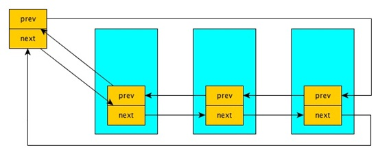

# 内核中高级语法和特殊数据结构

## \_\_attribute__

​    GNU C 的一大特色就是\_\_attribute__ 机制。\_\_attribute__ 可以设置函数属性（Function Attribute ）、变量属性（Variable Attribute ）和类型属性（Type Attribute ）。

```sh
#书写特征是：前后都有两个下划线，并切后面会紧跟一对原括弧，括弧里面是相应的__attribute__ 参数。
    __attribute__ 

#语法格式为：
    __attribute__ ((attribute-list))
```

示例代码：

https://github.com/qwe624758472/Learning_set/tree/master/Language/c%2B%2B/c

```c
static void __attribute__((constructor)) do_qemu_init_ ## function(void)    \
{                                                                           \
    register_module_init(function, type);                                   \
}
```

​    如果函数被设定为constructor属性，则该函数会在main（）函数执行之前被自动的执行；

​    若函数被设定为destructor属性，则该函数会在main（）函数执行之后或者exit（）被调用后被自动的执行。

解析：

​    1.从

## __read_mostly的使用

定义：

```c
#define __read_mostly  __attribute__((__section__(".data..read_mostly")))
```

使用：

```c
static unsigned int d_hash_shift __read_mostly;
```

也就是说被__read_mostly 形容的数据别放入到了段. data.read_mostly 中

那这个段的作用是什么呢？

定义到这个段的数据，再 linux 内核被加载时，数据会自动被存放到 cache 中，以提高整个系统的执行效率。另一方面，如果所在的平台没有 cache，或者有 cache，但是并没有提供存放数据的接口 (也就是不允许人工放置数据在 cache 中)，这样定义为__ead_mostly 类型的数据将不能存放在 linux 内核中，甚至也不能被加载到系统内存去执行，将造成 linux 内核启动失败。

**当不能存放数据时，解决方法:**

1，修改 inclue/asm/cache.h 中的__read_mostly 定义为空的，如:__

```c
__define __read_mostly 
```

2，修改 arch/mips/kernel/vmlinux.s，将. data.read_mostly 段的位置定义到实际内存空间中去。

## c语言的可变参数

```c
int func(int, ... ) 
{
   .
   .
   .
}

int main()
{
   func(2, 2, 3);
   func(3, 2, 3, 4);
}
```

* 使用 **int** 参数和 **va_start** 宏来初始化 **va_list** 变量为一个参数列表。
- 使用 **va_arg** 宏和 **va_list** 变量来访问参数列表中的每个项。

- 使用宏 **va_end** 来清理赋予 **va_list** 变量的内存。

```c
#include <stdio.h>
#include <stdarg.h>

double average(int num,...)
{

    va_list valist;
    double sum = 0.0;
    int i;

    /* 为 num 个参数初始化 valist */
    va_start(valist, num);

    /* 访问所有赋给 valist 的参数 */
    for (i = 0; i < num; i++)
    {
       sum += va_arg(valist, int);
    }
    /* 清理为 valist 保留的内存 */
    va_end(valist);

    return sum/num;
}

int main()
{
   printf("Average of 2, 3, 4, 5 = %f\n", average(4, 2,3,4,5));
   printf("Average of 5, 10, 15 = %f\n", average(3, 5,10,15));
}
```

# 内核中数据结构及宏定义

## 哈希表（散列表）

1.概述

2.功能

3.构造方法

要计算简单， 地址分布均匀(散列)

4.处理冲突的方法

* 开放定址法：一旦发生冲突，寻找下一个空的散列地址。
  * 线性探测法：
  * 随机探测法：

## 红黑树

## list_head

在Linux内核中，提供了一个用来创建双向循环链表的结构 list_head。虽然linux内核是用C语言写的，但是list_head的引入，使得内核数据结构也可以拥有面向对象的特性，通过使用操作list_head 的通用接口很容易实现代码的重用，有点类似于C++的继承机制。下面就是kernel中的list_head结构定义：

struct list_head {

　　struct list_head *next, *prev;

};

\#define LIST_HEAD_INIT(name) { &(name), &(name) }

需要注意的一点是，头结点head是不使用的，这点需要注意。

使用list_head组织的链表的结构如下图所示：



其实list_head不是拿来单独用的，它一般被嵌到其它结构中,container_of可以获取对应结构体的头指针。

## container_of

```c
#define container_of(ptr, type, member) __extension__ ({    \
    const __typeof__( ((type *)0)->member ) *__mptr = (ptr); \
    (type *)( (char *)__mptr - offsetof(type,member) );})
```

功能：已知结构体type的成员member的地址ptr，求解结构体type的起始地址。

## 宏定义中#和##

1.#是“字符串化”的意思。出现在宏定义中的#是把跟在后面的参数转换成一个字符串。

```c
//例如：
#define STRCPY(dst, src)   strcpy(dst, #src)
STRCPY(buff, abc)
//就是
strcpy(buff, "abc")
```

2.##是记号粘贴操作符。

```c
#define  FOO(arg)   my##arg
FOO(abc)
//就是
myabc
```

3.如果##后的参数本身也是一个宏的话，##会阻止这个宏的展开，也就是只替换一次。

```c
#define STRCPY(a, b)    strcpy(a ## _p, #b)
STRCPY(STRCPY(var1,var2),var2);
//则展开为
strcpy(STRCPY(var1,var2)_p,"var2")
```

4.##连接符

```c
#define A1(name, type)  type name_##type##_type

#define A2(name, type)  type name##_##type##_type

A1(a1, int);  /* 等价于: int name_int_type; */

A2(a1, int);  /* 等价于: int a1_int_type;   */
```

# 其他

## GFP_KERNEL

```c
//栗子：
struct data{
  int cout;
  char *name;
};
struct data da;
struct device *dev;
//申请内存,devm_kzalloc()函数自动释放内存
devm_kzalloc(dev, sizeof(struct stu), GFP_KERNEL);
//*************************************************************
//                 GFP_KERNEL的作用
//*************************************************************
//GFP_KERNEL是linux内存分配器的标志，标识着内存分配器将要采取的行为。
//分配器标志分为行为修饰符，区修饰符及类型。行为修饰符表示内核应当如何分配所需的内存。
//区修饰符表示内存区应当从何处分配。类型就是行为修饰符和区修饰符的合体。

//在include/linux/gfp.h中定义,GFP_KERNEL是内核内存分配时最常用的，无内存可用时可引起休眠.
#define GFP_KERNEL(__GFP_WAIT | __GFP_IO | __GFP_FS)
//__GFP_WAIT ： 缺内存页的时候可以睡眠;
//__GFP_IO ： 允许启动磁盘IO；
//__GFP_FS ： 允许启动文件系统IO。
```

# 内核模块

## 内核同步模块

自旋锁spin_lock、spin_lock_irq 和 spin_lock_irqsave

## Linux IDR机制

idr在linux内核中指的就是整数ID管理机制，从本质上来说，这就是一种将整数ID号和特定指针关联在一起的机制。

### 1. idr的使用场景

idr机制适用在那些需要把某个整数和特定指针关联在一起的地方。举个例子，在I2C总线中，每个设备都有自己的地址，要想在总线上找到特定的设备，就必须要先发送该设备的地址。如果我们的PC是一个I2C总线上的主节点，那么要访问总线上的其他设备，首先要知道他们的ID号，同时要在pc的驱动程序中建立一个用于描述该设备的结构体。

此时，问题来了，我们怎么才能将这个设备的ID号和他的设备结构体联系起来呢？最简单的方法当然是通过数组进行索引，但如果ID号的范围很大(比如32位的ID号)，则用数组索引显然不可能；第二种方法是用链表，但如果网络中实际存在的设备较多，则链表的查询效率会很低。遇到这种清况，我们就可以采用idr机制，该机制内部采用[radix树](http://liujunming.top/2018/03/20/数据结构-树的归纳总结/#基数树-Radix-Tree)实现，可以很方便地将整数和指针关联起来，并且具有很高的搜索效率。

### 2. idr的使用方法

#### 2.1 获得idr

要在代码中使用idr，首先要包括`<linux/idr.h>`。接下来，我们要在代码中分配`idr`结构体，并初始化：
`void idr_init(struct idr *idp)`;
其中idr定义如下：

```c
struct idr {
        struct idr_layer *top;
        struct idr_layer *id_free;
        int               layers;
        int               id_free_cnt;
        spinlock_t        lock;
};
```

`idr`是idr机制的核心结构体。

#### 2.2 为idr分配内存

`int idr_pre_get(struct idr *idp, unsigned int gfp_mask);`
每次通过idr获得ID号之前，需要先分配内存。
返回0表示错误，非零值代表正常

#### 2.3 分配ID号并将ID号和指针关联

```c
int idr_get_new(struct idr *idp, void *ptr, int *id);
int idr_get_new_above(struct idr *idp, void *ptr, int start_id, int *id);
```

idp: 之前通过idr_init初始化的idr指针
id: 由内核自动分配的ID号
ptr: 和ID号相关联的指针
start_id: 起始ID号。内核在分配ID号时，会从start_id开始。如果为I2C节点分配ID号，可以将设备地址作为start_id。
函数调用正常返回0，如果没有ID可以分配，则返回-ENOSPC
在实际中，上述函数常常采用如下方式使用：

```c
again:
  if (idr_pre_get(&my_idr, GFP_KERNEL) == 0) {
    /* No memory, give up entirely */
  }
  spin_lock(&my_lock);
  result = idr_get_new(&my_idr, &target, &id);
  if (result == -EAGAIN) {
    sigh();
    spin_unlock(&my_lock);
    goto again;
  }
```

#### 2.4 通过ID号搜索对应的指针

`void *idr_find(struct idr *idp, int id);`
返回值是和给定id相关联的指针，如果没有，则返回NULL

#### 2.5 删除ID

要删除一个ID，使用：
`void idr_remove(struct idr *idp, int id);`

通过上面这些方法，内核代码可以为子设备，inode生成对应的ID号。

### 3. idr的使用示例

```c
<linux/idr.h>   /* idr头文件 */
...
static DEFINE_IDR(i2c_adapter_idr); /* 声明idr */
...
/* 
  采用动态总线号声明并注册一个i2c适配器(adapter)，可睡眠
  针对总线号可动态指定的设备，如基于USB的i2c设备或pci卡
 */
int i2c_add_adapter(struct i2c_adapter *adapter)
{
        int     id, res = 0;
retry:
        if (idr_pre_get(&i2c_adapter_idr, GFP_KERNEL) == 0)
                return -ENOMEM;
        mutex_lock(&core_lists);
        /* __i2c_first_dynamic_bus_num是当前系统允许的动态总线号的最大值 */
        res = idr_get_new_above(&i2c_adapter_idr, adapter,                 __i2c_first_dynamic_bus_num, &id);
        mutex_unlock(&core_lists);
        if (res < 0) {
                if (res == -EAGAIN)
                        goto retry;
                return res;
        }
        adapter->nr = id;
        return i2c_register_adapter(adapter);
}
EXPORT_SYMBOL(i2c_add_adapter);

/* 
  采用静态总线号声明并注册一个i2c适配器(adapter)
 */
int i2c_add_numbered_adapter(struct i2c_adapter *adap)
{
        int     id;
        int     status;
        if (adap->nr & ~MAX_ID_MASK)
                return -EINVAL;
retry:
        if (idr_pre_get(&i2c_adapter_idr, GFP_KERNEL) == 0)
                return -ENOMEM;
        mutex_lock(&core_lists);
        /* "above" here means "above or equal to", sigh;
         * we need the "equal to" result to force the result
         */
        status = idr_get_new_above(&i2c_adapter_idr, adap, adap->nr, &id);
        if (status == 0 && id != adap->nr) {
                status = -EBUSY;
                idr_remove(&i2c_adapter_idr, id);
        }
        mutex_unlock(&core_lists);
        if (status == -EAGAIN)
                goto retry;
        if (status == 0)
                status = i2c_register_adapter(adap);
        return status;
}
EXPORT_SYMBOL_GPL(i2c_add_numbered_adapter);

/* 注销一个i2c适配器 */
int i2c_del_adapter(struct i2c_adapter *adap)
{
  ...
  /* free bus id */
  idr_remove(&i2c_adapter_idr, adap->nr);
  ...
  return res;
}
EXPORT_SYMBOL(i2c_del_adapter);

/* 通过ID号获得i2c_adapter设备结构体 */
struct i2c_adapter* i2c_get_adapter(int id)
{
        struct i2c_adapter *adapter;
        mutex_lock(&core_lists);
        adapter = (struct i2c_adapter *)idr_find(&i2c_adapter_idr, id);
        if (adapter && !try_module_get(adapter->owner))
                adapter = NULL;
        mutex_unlock(&core_lists);
        return adapter;
}
EXPORT_SYMBOL(i2c_get_adapter);
```

## 等待队列 wait_queue_head_t

Linux内核的等待队列是以双循环链表为基础数据结构，与进程调度机制紧密结合，能够用于实现核心的异步事件通知机制。

它有两种数据结构：等待队列头（wait_queue_head_t）和等待队列项（wait_queue_t）。

等待队列头和等待队列项中都包含一个list_head类型的域作为”连接件”。

它通过一个双链表和等待task的头，和等待的进程列表链接起来。

在内核里面，等待队列是有很多用处的，尤其是在中断处理、进程同步、定时等场合。

可以使用等待队列在实现阻塞进程的唤醒。

它以队列为基础数据结构，与进程调度机制紧密结合，能够用于实现内核中的异步事件通知机制，同步对系统资源的访问等。

结构:

```c
struct __wait_queue_head {
  spinlock_t lock;
  struct list_head task_list;
};
typedef struct __wait_queue_head wait_queue_head_t;
```

| 成员        | 描述                                  |
|:---------:|:-----------------------------------:|
| lock      | 在对task_list与操作的过程中，使用该锁实现对等待队列的互斥访问 |
| task_list | 双向循环链表，存放等待的进程                      |
