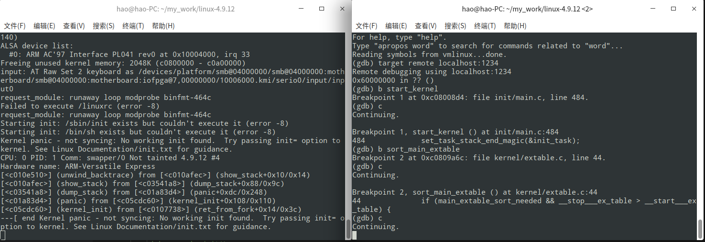
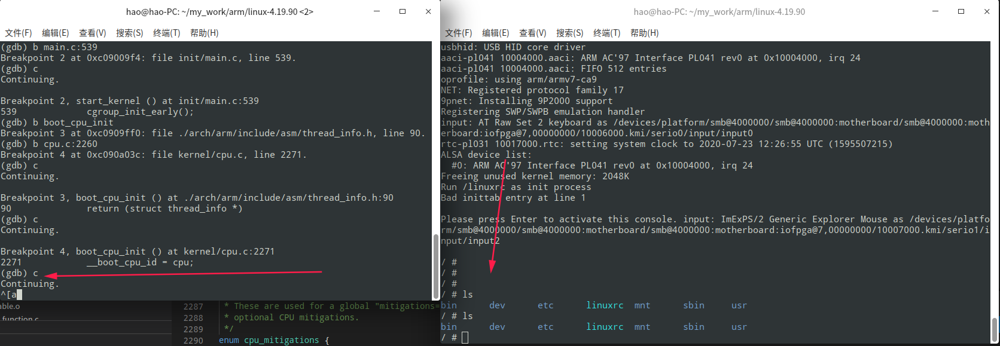

# 内核调试技术

## 一、使用GDB调试内核方法

### 1.ARM

1. sudo apt-get install qemu libncurses5-dev gcc-arm-linux-gnueabi buildessent  安装编译需要的工具包。

2. 下载linux源码，和下载busybox工具包：https://busybox.net/downloads/busybox-1.24.0.tar.bz2

3. 利用busybox编译最小文件系统：

```sh
   cd busybox
   export ARCH=arm
   export CROSS_COMPILE=arm-linux-gnueabi-
   make menuconfig
```

   进入menuconfig后，配置成静态编译。

   Busybox Settings ----> Build Options -----> [*]Build BusyBox as a static binary (no shared libs)

4. 然后make install 编译完成，在busybox跟目录会生成一个__install的目录，该目录是编译好的文件系统需要的一些命令集合。

5. 下载linux内核源码。 把_install目录复制到linux源码目录下。然后进入__install目录。

   ```sh
   mkdir etc
   mkdir dev
   mkdir mnt
   mkdir -p etc/init.d/
   ```

6. 创建etc,dev等目录。

7. 在__install /etc/init.d/目录下创建rcS文件，写入如下内容,并赋予可执行权限。

   ```sh
   mkdir -p /proc
   mkdir -p /tmp
   mkdir -p /sys
   mkdir -p /mnt
   /bin/mount -a
   mkdir -p /dev/pts
   mount -t devpts devpts /dev/pts
   echo /sbin/mdev > /proc/sys/kernel/hotplug
   mdev -s
   ```

8. 在__install/etc目录下创建一个fstab文件，并写入如下内容。 

   ```sh
   proc /proc proc defaults 0 0
   tmpfs /tmp tmpfs defaults 0 0
   sysfs /sys sysfs defaults 0 0
   tmpfs /dev tmpfs defaults 0 0
   debugfs /sys/kernel/debug debugfs defaults 0 0
   ```

9. 在__install/etc下创建一个inittab文件，并写入如下内容。

   ```sh
   ::sysinit:/bin/chmod 777 /etc/init.d/rcS
   ::sysinit:/etc/init.d/rcS
   ::respawn:-/bin/sh
   ::askfirst:-/bin/sh
   ::ctrlaltdel:/bin/umount -a -r
   ```

10. 在__install/dev目录下创建如下设备节点，需要root权限。

    ```sh
    cd _install/dev
    sudo mknod console c 5 1
    sudo mknod null c 1 3
    ```

11. 编译内核

    ```sh
    cd linux-4.*.**
    export ARCH=arm
    export CROSS_COMPILE=arm-linux-gnueabi-
    make vexpress_defconfig
    make menuconfig
    ```

12. 配置如下所示：

    

13. 开始编译内核

    ```sh
    make bzImage -j4 ARCH=arm CROSS_COMPILE=arm-linux-gnueabi-
    make dtbs
    ```

14. 安装gdb调试工具。 

    ```sh
    sudo apt-get install gdb-arm-none-eabi
    ```

    发现UOS没有这个软件，但是有个新版本的。 叫gdb-multiarch,安装上述软件时会自动安装这个，应该是更新版。

15. 首先要确保编译的内核包含调试信息。Kernel haking-->Compile-time checks and compiler options --->[*]Compile the kernel with debug info。  勾选后重新编译内核。 然后启动内核：

    ```sh
    qemu-system-arm -nographic -M vexpress-a9 -m 1024M -kernel arch/arm/boot/zImage -append "rdinit=/linuxrc console=ttyAMA0 loglevel=8" -dtb arch/arm/boot/dts/vexpress-v2p-ca9.dtb -S -s
    
    
    这俩实验还未通过
    qemu-system-arm -nographic -M vexpress-a9 -m 512M -kernel arch/arm/boot/zImage -append "root=/dev/mmcblk0 rw console=ttyAMA0" -dtb arch/arm/boot/dts/vexpress-v2p-ca9.dtb -sd rootfs_ext4.img
    
    
    qemu-system-arm -M vexpress-a9 -m 512M -kernel linux-4.4.76/arch/arm/boot/zImage -dtb linux-4.4.76/arch/arm/boot/dts/vexpress-v2p-ca9.dtb  -append "root=/dev/mmcblk0 rw console=tty0" -sd rootfs.ext3
    
    ```
    

重新启动一个控制台，运行gdb-multiarch vmlinux，进入控制台，开始打断点并执行，命令如下：
    
```sh
    target remote localhost:1234      	#通过1234端口远程连接到QEMU平台
b start_kernel  					#在start_kernel处打一个断点。 
    b sort_main_extable    				#在sort_main_extable函数处打一个断点。
    c 									#开始让内核运行。
```

    如下图所示：
    
    
    
    完全运行时，进入系统后显示如下图所示：


上述内容为使用qemu直接启动linux内核,没有使用u-boot引导.

若要使用u-boot进行引导,则下载uboot代码,进行对应平台的编译如下命令,然后qemu参数填写对应平台,填写u-boot位置,并启动.  启动后可以通过tftp下载内核,进行引导.

```sh
export ARCH=arm
export CROSS_COMPILE=arm-linux-gnueabi-
make  vexpress_ca9x4_defconfig
make -j4


qemu-system-arm -M vexpress-a9 -m 256 -kernel u-boot --nographic
```


### 2.X86

X86使用的qemu和arm不同，x86使用的是qemu-system-x86_64

1. sudo apt-get install qemu libncurses5-dev gcc-arm-linux-gnueabi buildessent  qemu-system-x86_64安装编译需要的工具包。

2. 下载linux源码，和下载busybox工具包：https://busybox.net/downloads/busybox-1.24.0.tar.bz2

3. 编译linux的x86_64内核。

   编译之前需要打开内核调试功能：Kernel hacking --> Compile-time checks and compiler options --> Compile the kernel with debug info

   ```sh
   make x86_64_defconfig    #生成x86_64版本配置文件．
   make bzImage   #编译内核
   make modules   #编译内核模块
   ```

4. 启动内核．

   ```sh
   qemu-system-x86_64　-m 512M　-smp 4　-kernel ./bzImage
   ```

   上述命令假设编译好的 bzImage 内核文件就存放在当前目录下。不出意外的话，就可以在启动窗口中看到内核的启动日志了。在内核启动的最后，会出现一条 panic 日志：

   ```sh
   Kernel panic - not syncing: VFS: Unable to mount root fs on unknown-block(0, 0)
   ```

     从日志内容可以看出，内核启动到一定阶段后尝试加载根文件系统，但我们没有指定任何磁盘设备，所以无法挂载根文件系统。而且上一节中编译出来的内核模块现在也没有用上，内核模块也需要存放到文件系统中供内核需要的时候进行加载。所以，接下来需要制作一个磁盘镜像文件供内核作为根文件系统加载。

5. 创建磁盘镜像文件，使用 qemu-img创建一个 512M 的磁盘镜像文件：

   ```sh
   qemu-img create -f raw disk.raw 512M
   ```

   现在 disk.raw 文件就相当于一块磁盘，为了在里面存储文件，需要先进行格式化，创建文件系统。

   ```sh
   mkfs -t ext4 ./disk.raw
   ```

6. 挂载磁盘镜像文件。

   ```sh
   sudo mount -o loop ./disk.raw ./img
   ```

7. 安装内核模块。 将之前编译好的内核模块安装到磁盘镜像中，命令如下：

   ```sh
   sudo make modules_install INSTALL_MOD_PATH=./img  # 指定安装路径
   ```

   完成后会在./img/lib/modules/下看到安装好的内核模块。

8. 使用磁盘文件启动qemu：

   ```sh
   qemu-system-x86_64 -m 512M -smp 4 -kernel ./arch/x86_64/boot/bzImage -drive format=raw,file=./disk.raw -append "root=/dev/sda"
   ```

   file=./disk.raw : 指定文件作为磁盘。   root=/dev/sda :内核启动参数，指定根文件系统所在设备。

   不出意外的话，会显示：

   ```sh
   Kernel panic - not syncing: No working init found. Try passing init= option to Kernel. See Linux Documentation/admin-guide/init.rst for guidance.
   ```

   说明启动参数里边没有指定init选项，磁盘镜像中也没有相应的init程序。

9. 编译busybox：

   ```sh
   make defconfig
   make menuconfig
   ```

   这里有一个重要的配置，因为 busybox 将被用作 init 程序，而且我们的磁盘镜像中没有任何其它库，所以 busybox 需要被静态编译成一个独立、无依赖的可执行文件，以免运行时发生链接错误。配置路径如下：

   ```sh
   Busybox Settings --->
          --- Build Options
          [*] Build BusyBox as a static binary (no shared libs)
   ```

   最后，编译并安装到磁盘镜像中：

   ```sh
   make
   make CONFIG_PREFIX=需要安装的文件夹路径 install
   ```

10. 加入init内核启动参数来指定busybox作为init进程，再次尝试启动。

    ```sh
    qemu-system-x86_64 -m 512M -smp 4 -kernel ./bzImage -drive format=raw,file=./disk.raw -append "init=/linuxrc root=/dev/sda"
    ```

    还是有问题，会出现：

    ```sh
    can't run '/etc/init.d/rcS': No such file or directory
    can't open /dev/tty3: No such file or directory
    can't open /dev/tty4: No such file or directory
    ```

    init进程执行报错，需要配置。 

11. init 启动后会扫描/etc/inittab配置文件，这个配置文件决定了init程序的行为。而busybox init再没有/etc/inittab文件的情况下也能工作，因为它有默认行为。它的默认行为相当于如下配置：

    ```sh
    ::sysinit:/etc/init.d/rcS
    ::askfirst:/bin/sh
    ::ctrlaltdel:/sbin/reboot
    ::shutdown:/sbin/swapoff -a
    ::shutdown:/bin/umount -a -r
    ::restart:/sbin/init
    tty2::askfirst:/bin/sh
    tty3::askfirst:/bin/sh
    tty4::askfirst:/bin/sh
    ```

    但是不能这样用，需要去掉后边的三行。 如下：

    ```sh
    ::sysinit:/etc/init.d/rcS
    ::askfirst:/bin/ash
    ::ctrlaltdel:/sbin/reboot
    ::shutdown:/sbin/swapoff -a
    ::shutdown:/bin/umount -a -r
    ::restart:/sbin/init
    ```

12. 创建可执行文件/etc/init.d/rcS 内容如下（暂时啥都不做，后边要加）：

    ```sh
    #!/bin/sh
    ```

    这次应该可以进入控制台。 但是/dev  这些都不能访问。

13. 创建并在脚本中挂载/dev,/proc, /sys 文件系统：

    ```sh
    mkdir ./img/dev ./img/proc ./img/sys
    ```

    并修改etc/init.d/rcS :

    ```sh
    #!/bin/sh
    mount -t proc proc /proc
    mount -t sysfs sysfs /sys
    ```

    重启系统，可以查看/dev,/proc,/sys挂载点都有了相应的内容。

14. 到此处qemu已经可以启动linux内核了， 下来介绍启动时使用GDB调试并打断点到方法。

    开始启动内核，并在启动时暂停：

    ```sh
    sudo umount /dev/loop0  #先将上面挂载的img文件夹卸载掉
    
    qemu-system-x86_64 -m 512M -smp 4 -kernel ./bzImage -drive format=raw,file=./disk.raw -append "init=/linuxrc root=/dev/sda nokaslr" -S -s
    ```

    nokaslr：不加nokaslr可能导致断点不生效。因为kernel address space layout randomation（内核地址空间布局随机化），这样内核地址不就不一致了，禁掉就好了。

    -S ：Do not start CPU at startup (you must type 'c' in the monitor).

    -s：Shorthand for -gdb tcp::1234, i.e. open a gdbserver on TCP port 1234(see [gdb_usage](http://qemu.weilnetz.de/qemu-doc.html#gdb_005fusage)). 

    qemu参数介绍参考文档：https://blog.csdn.net/wj_j2ee/article/details/7800647?utm_medium=distribute.pc_relevant.none-task-blog-BlogCommendFromMachineLearnPai2-2.channel_param&depth_1-utm_source=distribute.pc_relevant.none-task-blog-BlogCommendFromMachineLearnPai2-2.channel_param

15. 步骤14会在qemu启动时暂停，必须使用另一个终端启动gdb并加载未压缩内核（内核符号表），然后链接通过tcp链接本地1234端口，然后加断点，最后使用c，开始执行到断点处，后边使用和GDB调试相同，不做赘述。命令如下：

    ```sh
    sh> gdb vmlinux
    (gdb)target remote localhost:1234
    (gdb)b start_main
    (gdb)c
    ```

    断点调试效果如下图所示：

### 3.龙芯(Loogson)

暂时没有龙芯机器，所以暂时没有调试方案，后期有龙芯机器可参考X86调试方法来调试龙芯机器。

## 二、其他调试方法

### 1.printk(): 

用法：printk(优先级宏"test -> %s %d\n", _ _FILE_ _, _ LINE_ _);

printk有八种优先级：

```c
KERN_EMERG:用于紧急事件消息，一般是系统崩溃之前的提示的消息。
KERN_ALERT:用于需要立即采取动作的情况。
KERN_CRIT:临界状态，通常涉及严重的硬件或软件操作失败。
KERN_ERR:用于报告错误状态。设备驱动程序会经常使用KERN_ERR来报告来自硬件的问题。
KERN_WARNING:对可能出现问题的情况进行警告，但这类情况通常不会对系统造成严重问题。
KERN_NOTICE：有必要进行提示的正常情况。 许多与安全相关的状况用这个级别进行汇报。
KERN_INFO:提示性信息。 许多驱动程序再启动的时候以这个级别来打印出它们找到的硬件信息。
KERN_DEBUG：用于调试信息。
```

注：要在终端初始化之后，调用。

### 2. 

## 三、特殊事件处理方法

### 1.输入事件监控

安装事件监控软件: 

```sh
sudo apt-get install evtest
```

查看输入设备事件的名字：

```sh
cat /sys/class/input/event2/device/name
```

查看ACPI的中断产生次数：

```sh
cat /proc/interrupts | grep acpi
```

运行监控程序，拦截输入事件：

```sh
sudo evtest --grab /dev/input/event2
```

### 2.

## 四、内核问题定位方法

1. 出现BUG。
2. 确认BUG出现的内核版本号，需要分析出这个BUG在哪个版本被引入。同步出现BUG的代码。
3. 找出该BUG复现方法。


## 其他

### 1. 打内核path

   例如：内核4.9.12内核源码编译时出现下图所示错误：

   这种情况就是版本代码不对应导致,需要打path，例如path文件名为path.diff.

* 将path文件合入当前版本代码中：

  ```sh
  diff --git include/linux/log2.h include/linux/log2.h
  ```

* 会提示输入两文件路径。依次输入：

  ```sh
  include/linux/log2.h
  tools/include/linux/log2.h
  ```


