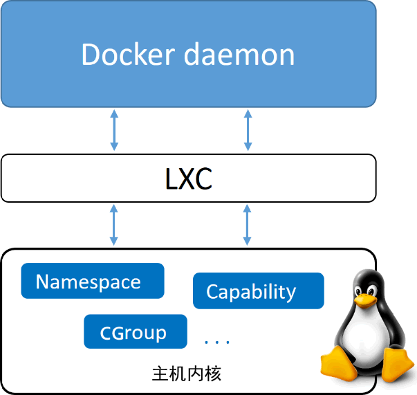
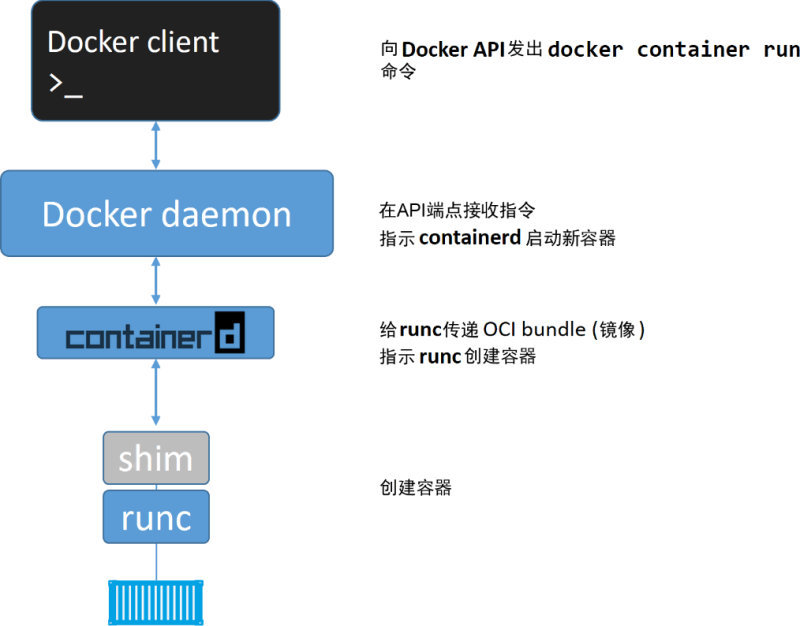
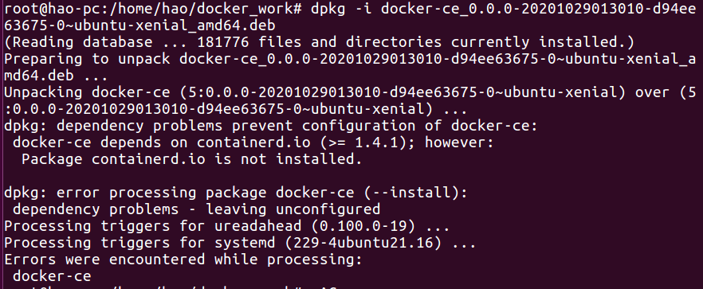
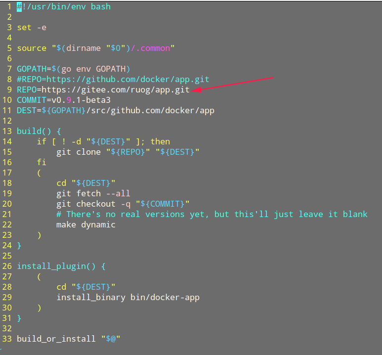
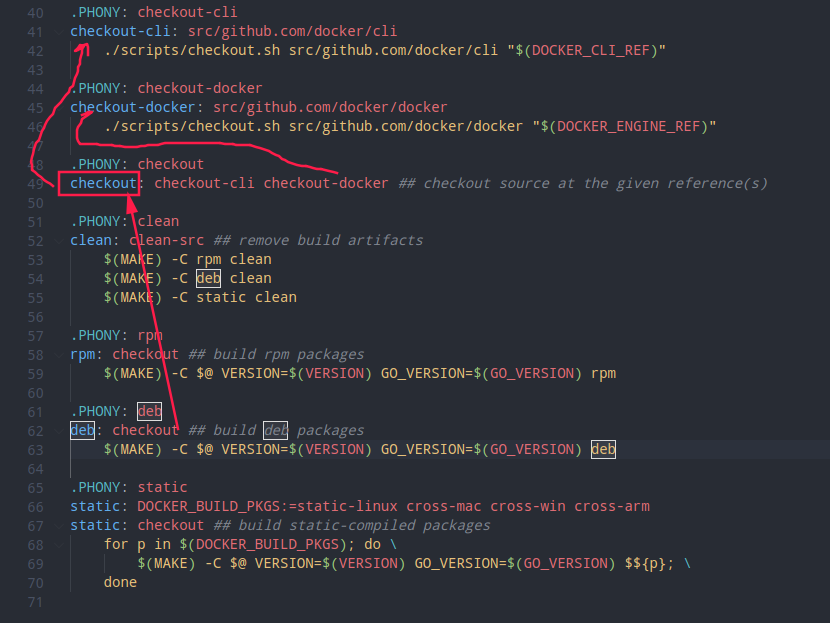
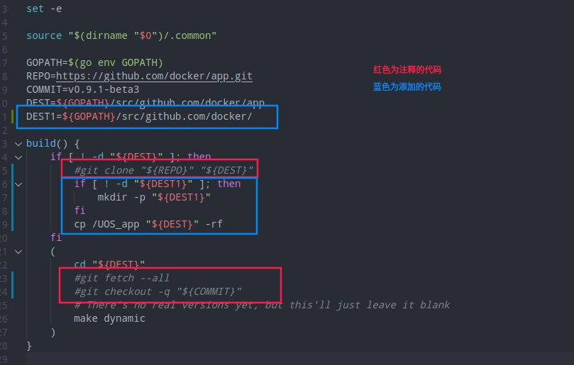
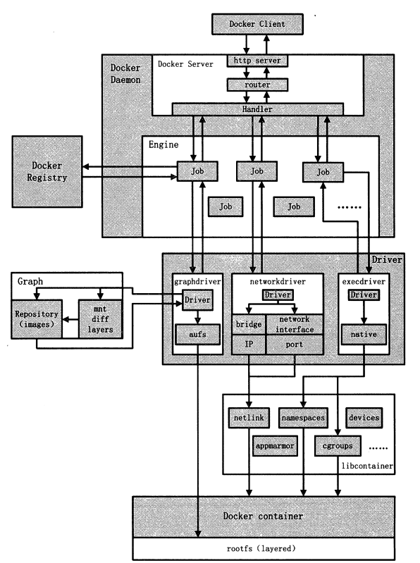

# Docker

## 0.docker组件和历史

[**[Docker](http://c.biancheng.net/docker/) 引擎**]是用来运行和管理容器的核心软件。通常人们会简单地将其代指为 Docker 或 Docker 平台。

如果你对 VMware 略知一二，那么可以将 Docker 引擎理解为 ESXi 的角色。

基于开放容器计划（OCI）相关标准的要求，Docker 引擎采用了模块化的设计原则，其组件是可替换的。

从多个角度来看，Docker 引擎就像汽车引擎——二者都是模块化的，并且由许多可交换的部件组成。

汽车引擎由许多专用的部件协同工作，从而使汽车可以行驶，例如进气管、节气门、气缸、火花塞、排气管等。

Docker 引擎由许多专用的工具协同工作，从而可以创建和运行容器，例如 API、执行驱动、运行时、shim 进程等。

Docker 引擎由如下主要的组件构成：Docker 客户端（Docker Client）、Docker 守护进程（Docker daemon）、containerd 以及 runc。它们共同负责容器的创建和运行。

总体逻辑如下图所示。


Docker 首次发布时，Docker 引擎由两个核心组件构成：LXC 和 Docker daemon。

Docker daemon 是单一的二进制文件，包含诸如 Docker 客户端、Docker API、容器运行时、镜像构建等。

LXC 提供了对诸如命名空间（Namespace）和控制组（CGroup）等基础工具的操作能力，它们是基于 Linux 内核的容器虚拟化技术。

下图阐释了在 Docker 旧版本中，Docker daemon、LXC 和操作系统之间的交互关系。



### 1.摆脱 LXC

对 LXC 的依赖自始至终都是个问题。

首先，LXC 是基于 Linux 的。这对于一个立志于跨平台的项目来说是个问题。

其次，如此核心的组件依赖于外部工具，这会给项目带来巨大风险，甚至影响其发展。

因此，Docker 公司开发了名为 Libcontainer 的自研工具，用于替代 LXC。

Libcontainer 的目标是成为与平台无关的工具，可基于不同内核为 Docker 上层提供必要的容器交互功能。

在 Docker 0.9 版本中，Libcontainer 取代 LXC 成为默认的执行驱动。

### 2.摒弃大而全的 Docker daemon

随着时间的推移，Docker daemon 的整体性带来了越来越多的问题。难于变更、运行越来越慢。这并非生态（或Docker公司）所期望的。

Docker 公司意识到了这些问题，开始努力着手拆解这个大而全的 Docker daemon 进程，并将其模块化。

这项任务的目标是尽可能拆解出其中的功能特性，并用小而专的工具来实现它。这些小工具可以是可替换的，也可以被第三方拿去用于构建其他工具。

这一计划遵循了在 UNIX 中得以实践并验证过的一种软件哲学：小而专的工具可以组装为大型工具。

这项拆解和重构 Docker 引擎的工作仍在进行中。不过，所有容器执行和容器运行时的代码已经完全从 daemon 中移除，并重构为小而专的工具。

目前 Docker 引擎的架构示意图如下图所示，图中有简要的描述。


### 3.开放容器计划(OCI)的影响

当 Docker 公司正在进行 Docker daemon 进程的拆解和重构的时候，OCI 也正在着手定义两个容器相关的规范（或者说标准）。

镜像规范和容器运行时规范，两个规范均于 2017 年 7 月发布了 1.0 版。

Docker 公司参与了这些规范的制定工作，并贡献了许多的代码。

从 Docker 1.11 版本（2016 年初）开始，Docker 引擎尽可能实现了 OCI 的规范。例如，Docker daemon 不再包含任何容器运行时的代码——所有的容器运行代码在一个单独的 OCI 兼容层中实现。

默认情况下，Docker 使用 runc 来实现这一点。runc 是 OCI 容器运行时标准的参考实现。

如上图中的 runc 容器运行时层。runc 项目的目标之一就是与 OCI 规范保持一致。

目前 OCI 规范均为 1.0 版本，我们不希望它们频繁地迭代，毕竟稳定胜于一切。

除此之外，Docker 引擎中的 containerd 组件确保了 Docker 镜像能够以正确的 OCI Bundle 的格式传递给 runc。

其实，在 OCI 规范以 1.0 版本正式发布之前，Docker 引擎就已经遵循该规范实现了部分功能。

### 4.runc

如前所述，runc 是 OCI 容器运行时规范的参考实现。Docker 公司参与了规范的制定以及 runc 的开发。

去粗取精，会发现 runc 实质上是一个轻量级的、针对 Libcontainer 进行了包装的命令行交互工具（Libcontainer 取代了早期 Docker 架构中的 LXC）。

runc 生来只有一个作用——创建容器，这一点它非常拿手，速度很快！不过它是一个 CLI 包装器，实质上就是一个独立的容器运行时工具。

因此直接下载它或基于源码编译二进制文件，即可拥有一个全功能的 runc。但它只是一个基础工具，并不提供类似 Docker 引擎所拥有的丰富功能。

有时也将 runc 所在的那一层称为“OCI 层”，如上图所示。关于 runc 的发布信息见 GitHub 中 opencontainers/runc 库的 release。

### 5.containerd

在对 Docker daemon 的功能进行拆解后，所有的容器执行逻辑被重构到一个新的名为 containerd（发音为 container-dee）的工具中。

它的主要任务是容器的生命周期管理——start | stop | pause | rm....

containerd 在 Linux 和 Windows 中以 daemon 的方式运行，从 1.11 版本之后 Docker 就开始在 Linux 上使用它。

Docker 引擎技术栈中，containerd 位于 daemon 和 runc 所在的 OCI 层之间。Kubernetes 也可以通过 cri-containerd 使用 containerd。

如前所述，containerd 最初被设计为轻量级的小型工具，仅用于容器的生命周期管理。然而，随着时间的推移，它被赋予了更多的功能，比如镜像管理。

其原因之一在于，这样便于在其他项目中使用它。比如，在 Kubernetes 中，containerd 就是一个很受欢迎的容器运行时。

然而在 Kubernetes 这样的项目中，如果 containerd 能够完成一些诸如 push 和 pull 镜像这样的操作就更好了。

因此，如今 containerd 还能够完成一些除容器生命周期管理之外的操作。不过，所有的额外功能都是模块化的、可选的，便于自行选择所需功能。

所以，Kubernetes 这样的项目在使用 containerd 时，可以仅包含所需的功能。

containerd 是由 Docker 公司开发的，并捐献给了云原生计算基金会（Cloud Native Computing Foundation, CNCF）。2017 年 12 月发布了 1.0 版本，具体的发布信息见 GitHub 中的 containerd/ containerd 库的 releases。

### 6.启动一个新的容器

现在我们对 Docker 引擎已经有了一个总体认识，也了解了一些历史，下面介绍一下创建新容器的过程。

常用的启动容器的方法就是使用 Docker 命令行工具。下面的`docker container run`命令会基于 alpine:latest 镜像启动一个新容器。

$ docker container run --name ctr1 -it alpine:latest sh

当使用 Docker 命令行工具执行如上命令时，Docker 客户端会将其转换为合适的 API 格式，并发送到正确的 API 端点。

API 是在 daemon 中实现的。这套功能丰富、基于版本的 REST API 已经成为 Docker 的标志，并且被行业接受成为事实上的容器 API。

一旦 daemon 接收到创建新容器的命令，它就会向 containerd 发出调用。daemon 已经不再包含任何创建容器的代码了！

daemon 使用一种 CRUD 风格的 API，通过 gRPC 与 containerd 进行通信。

虽然名叫 containerd，但是它并不负责创建容器，而是指挥 runc 去做。

containerd 将 Docker 镜像转换为 OCI bundle，并让 runc 基于此创建一个新的容器。

然后，runc 与操作系统内核接口进行通信，基于所有必要的工具（Namespace、CGroup等）来创建容器。容器进程作为 runc 的子进程启动，启动完毕后，runc 将会退出。

至此，容器启动完毕。整个过程如下图所示。



### 7.该模型的显著优势

将所有的用于启动、管理容器的逻辑和代码从 daemon 中移除，意味着容器运行时与 Docker daemon 是解耦的，有时称之为“无守护进程的容器（daemonless container）”，如此，对 Docker daemon 的维护和升级工作不会影响到运行中的容器。

在旧模型中，所有容器运行时的逻辑都在 daemon 中实现，启动和停止 daemon 会导致宿主机上所有运行中的容器被杀掉。

这在生产环境中是一个大问题——想一想新版 Docker 的发布频次吧！每次 daemon 的升级都会杀掉宿主机上所有的容器，这太糟了！

幸运的是，这已经不再是个问题。

### 8.shim

shim 是实现无 daemon 的容器（用于将运行中的容器与 daemon 解耦，以便进行 daemon 升级等操作）不可或缺的工具。

前面提到，containerd 指挥 runc 来创建新容器。事实上，每次创建容器时它都会 fork 一个新的 runc 实例。

不过，一旦容器创建完毕，对应的 runc 进程就会退出。因此，即使运行上百个容器，也无须保持上百个运行中的 runc 实例。

一旦容器进程的父进程 runc 退出，相关联的 containerd-shim 进程就会成为容器的父进程。作为容器的父进程，shim 的部分职责如下。

- 保持所有 STDIN 和 STDOUT 流是开启状态，从而当 daemon 重启的时候，容器不会因为管道（pipe）的关闭而终止。
- 将容器的退出状态反馈给 daemon。

### 9.在linux中的实现

在 Linux 系统中，前面谈到的组件由单独的二进制来实现，具体包括 dockerd(Docker daemon)、docker-containerd(containerd)、docker-containerd-shim (shim) 和 docker-runc (runc)。

通过在 Docker 宿主机的 Linux 系统中执行 ps 命令可以看到以上组件的进程。当然，有些进程只有在运行容器的时候才可见。

### 10.daemon的作用

当所有的执行逻辑和运行时代码都从 daemon 中剥离出来之后，问题出现了—— daemon 中还剩什么？

显然，随着越来越多的功能从 daemon 中拆解出来并被模块化，这一问题的答案也会发生变化。

不过，daemon 的主要功能包括镜像管理、镜像构建、REST API、身份验证、安全、核心网络以及编排。

## 1.moby,docker-ce和docker-ee的区别

moby、docker-ce与docker-ee
最早的时候docker就是一个开源项目，主要由docker公司维护。

2017年年初，docker公司将原先的docker项目改名为moby，并创建了docker-ce和docker-ee。

这三者的关系是：

moby是继承了原先的docker的项目，是社区维护的的开源项目，谁都可以在moby的基础打造自己的容器产品

docker-ce是docker公司维护的开源项目，是一个基于moby项目的免费的容器产品
docker-ee是docker公司维护的闭源产品，是docker公司的商业产品。

moby project由社区维护，docker-ce project是docker公司维护，docker-ee是闭源的。
要使用免费的docker，从网页docker-ce上获取。

要使用收费的docker，从网页docker-ee上获取。

docker-ce的发布计划
v1.13.1之后，发布计划更改为:

Edge: 月版本，每月发布一次，命名格式为YY.MM，维护到下个月的版本发布
Stable: 季度版本，每季度发布一次，命名格式为YY.MM，维护4个月
docker-ce的release计划跟随moby的release计划，可以使用下面的命令直接安装最新的docker-ce:

```sh
curl -fsSL https://get.docker.com/ | sh
```

## 2.moby和docker-ce的关系

moby遵循[Apache Licene 2.0 协议],允许代码修改再发布（作为商业或开源软件）．docker-ce基于moby.

docker以每月发布一个版本的节奏进行开发。命名规则为：年份-月份-ce，其中ce表示社区版本。

1.使用moby编译时,需要自己下载cli,等多个代码,进行一个一个的编译.

2.使用docker-ce编译时,只需要下载docker-ce代码,进行编译,docker-ce下包含cli代码.

## 3.docker-ce, containerd.io和docker-cli之间的关系

- containerd.io - daemon to interface with the OS API (in this case, LXC - Linux Containers), essentially decouples Docker from the OS, also provides container services for non-Docker container managers
- docker-ce - Docker daemon, this is the part that does all the management work, requires the other two on Linux
- docker-ce-cli - CLI tools to control the daemon, you can install them on their own if you want to control a remote Docker daemon

## 4.docker的安装和使用

**CentOS**
如果是centos，上面的安装命令会在系统上添加yum源:

```sh
/etc/yum.repos.d/docker-ce.repo
```

然后用yum安装:

```sh
yum install -y docker-ce
```

yum源文件和rpm包都在网页download.docker.com中，可以自己下载安装:

```sh
wget https://download.docker.com/linux/centos/docker-ce.repo
mv docker-ce.repo /etc/yum.repos.d
yum install -y docker-ce
```

或者直接下载rpm安装:

```sh
wget https://download.docker.com/linux/centos/7/x86_64/stable/Packages/docker-ce-17.09.0.ce-1.el7.centos.x86_64.rpm
yum localinstall docker-ce-17.09.0.ce-1.el7.centos.x86_64.rpm
```

**UOS**

统信官方给的安装教程:

https://blog.csdn.net/weixin_43855876/article/details/107227120

```sh
#容器
容器技术已经成为应用程序分装和交付的核心技术
容器技术内核组成（Cgroups-资源管理 NameSpace-进程隔离）
由于是在物理机器上实施隔离、启动一个容器、可以像启动一个进程一样快速

#docker
docker是完整的一套容器管理系统
Docker 可以让开发者打包他们的应用以及依赖包到一个轻量级、可移植的容器中，然后发布到任何流行的 Linux 机器上，也可以实现虚拟化。
容器是完全使用沙箱机制，相互之间不会有任何接口（类似 iPhone 的 app）,更重要的是容器性能开销极低。
#Docker 的优点
#1、简化程序：
Docker 让开发者可以打包他们的应用以及依赖包到一个可移植的容器中，然后发布到任何流行的 Linux 机器上，便可以实现虚拟化。Docker改变了虚拟化的方式，使开发者可以直接将自己的成果放入Docker中进行管理。方便快捷已经是 Docker的最大优势，过去需要用数天乃至数周的 任务，在Docker容器的处理下，只需要数秒就能完成。
#2、避免选择恐惧症：
如果你有选择恐惧症，还是资深患者。Docker 帮你 打包你的纠结！比如 Docker 镜像；Docker 镜像中包含了运行环境和配置，所以 Docker 可以简化部署多种应用实例工作。比如 Web 应用、后台应用、数据库应用、大数据应用比如 Hadoop 集群、消息队列等等都可以打包成一个镜像部署。
#3、节省开支：
一方面，云计算时代到来，使开发者不必为了追求效果而配置高额的硬件，Docker 改变了高性能必然高价格的思维定势。Docker 与云的结合，让云空间得到更充分的利用。不仅解决了硬件管理的问题，也改变了虚拟化的方式。
#Docker 架构
Docker 使用客户端-服务器 (C/S) 架构模式，使用远程API来管理和创建Docker容器。
Docker 容器通过 Docker 镜像来创建。

#实验-安装docker
apt update
apt install -y docker.io
systemctl restart docker
docker versionClient:
Version: 18.09.1
API version: 1.39
Go version: go1.11.6
Git commit: 4c52b90
Built: Tue, 03 Sep 2019 19:59:35 +0200
OS/Arch: linux/amd64
Experimental: false

Server:
Engine:
Version: 18.09.1
API version: 1.39 (minimum version 1.12)
Go version: go1.11.6
Git commit: 4c52b90
Built: Tue Sep 3 17:59:35 2019
OS/Arch: linux/amd64
Experimental: false

#实验-镜像的基本操作
docker镜像查询
docker search uos
docker pull uosproject/uos //下载镜像
docker images //查看镜像
docker push uosproject/uos //上传镜像
docker save uosproject/uos:latest -o uos.tar //导出uos镜像为uos.tar
docker load -i nginx.tar //倒入本地镜像
docker rmi nginx //删除镜像
docker run -it uosproject/uos bash //以bash环境启动镜像
docker ps -a //#不加-a只显示运行状态的docker进程，每次都随机创建容器名和容器ID
docker logs 597b8cd3ca55 //通过容器ID来查询日志
docker tag uosproject/uos:latest uosproject/txuos:v1 //修改镜像的名称和标签,默认标签为latest
docker inspect uosproject/uos //查看镜像的底层信息

#实验-容器命令
docker stop 597b8cd3ca55 //通过容器ID关闭容器
docker start 597b8cd3ca55 //启动容器
docker attach 597b8cd3ca55 //连接到容器
docker ps //查看容器以关闭
docker start 597b8cd3ca55
docker exec -it 597b8cd3ca55 bash
docker ps //容器不会关闭
docker top 597b8cd3ca55 //查看容器进程列表
//过滤mac地址和ip地址
docker inspect -f ‘{{.NetworkSettings.MacAddress}}’ 597b8cd3ca55
02:42:ac:11:00:02
docker inspect -f ‘{{.NetworkSettings.IPAddress}}’ 597b8cd3ca55
172.17.0.2

#启动新容器并挂载
docker run -it -p 8070:8080 -v /root/software:/software --privileged=true docker.io/centos /bin/bash
-it 创建一个交互式的容器
-p 映射端口8070 本机的端口 映射的容器的端口
-v 挂载目录/root/software 本地目录 /software容器目录，在创建前容器是没有software目录的，docker 容器会自己创建
--privileged=true 关闭安全权限，否则你容器操作文件夹没有权限

#实验-修改镜像内容
docker load -i nginx.tar
docker run -it nginx:latest bash
docker ps -a
docker start 9725ff87872e
docker exec -it 9725ff87872e bash
#echo ‘UOS web’ > /usr/local/nginx/html/index.html
#nginx
#exit

docker inspect 9725ff87872e
apt install -y curl
curl 172.17.0.2 //可以访问到容器提供的web页面

#实验-mysql
docker run -d -p 33060:3306 -e MYSQL_ROOT_PASSWORD=1q2w3e4r.A -v /mysql:/var/lib/mysql --name=mysql mysql:5.5
yum install -y mysql
mysql -h192.168.200.201 -P33060 -uroot -p1q2w3e4r.A
mysql -h172.17.0.2 -P3306 -uroot -p1q2w3e4r.A
create database wordpress;

#实验-wordpress
提前准备好数据库
docker run -d -p 80:80 --name=wordpress --link=mysql wordpress:4.9.4
docker ps -a
docker start 06e09e14660b
docker exec -it 06e09e14660b bash
docker inspect 06e09e14660b
firefox 172.17.0.2

#挂载文件夹命令
docker run -it -v /home/dock/Downloads:/usr/Downloads:ro ubuntu64 /bin/bash


#打包自己的docker镜像，并放到其他机器上使用该镜像
```

**docker拉镜像特别慢，解决方法，配置加速**

```js
//docker配置加速器：
//添加文件：/etc/docker/daemon.json
//文件内容为：
{
"log-driver": "json-file",
"log-opts": {
    "max-size": "100m",
    "max-file": "3"
    },
"max-concurrent-downloads": 10,
"max-concurrent-uploads": 10,
"registry-mirrors": ["https://rce4gd7j.mirror.aliyuncs.com"]
}
```

修改完后，重启docker

```sh
systemctl daemon-reload  && systemctl restart docker
```

注：使用docker需要先启动服务器.

```sh
#centos下启动docker-daemon守护进程
systemctl daemon-reload
systemctl restart docker.service

#deb系下启动: 没试过.
service docker restart
```

## 5.docker-ce编译

### 一、环境搭建

docker的编译，需要在宿主机预先安装docker软件。因为编译docker的源码时，会构建一个docker镜像并运行，在这个容器里面进行build操作。由于这个容器已经包含了go语言环境，故宿主机无须额外安装golang。
宿主机系统：uos
宿主机docker版本：Docker version 19.03.8, build 1b4342cd4c

### 二、下载源码

docker的github官方网站为：https://github.com/docker/docker-ce/。
docker以每月发布一个版本的节奏进行开发。命名规则为：`年份-月份-ce`，其中ce表示社区版本。截至本文撰写时，最新版本为`v17.12.0-ce`，但下一版本`v18.01.0-ce-dev`已经处于开发阶段（带dev表示开发阶段），本文编译得到的版本即为`v18.01.0-ce-dev`。
发行版本下载地址：https://github.com/docker/docker-ce/releases。
本文在`/home/latelee/docker/dev`目录进行，请根据实际情况修改目录。
下载源码：

```sh
git clone https://github.com/docker/docker-ce
#或者
git clone https://gitee.com/ruog/docker-ce.git
```

进入docker-ce目录：

```sh
cd docker-ce
```

切换到最新的tag：

```sh
git checkout -b v18.01.0-ce
```

最后编译通过用的该命令: 

在/home/hao/docker_work/docker-ce文件夹下执行该命令:

```sh
make  VERSION=18.01.0-ce-dev ENGINE_DIR=/home/hao/docker_work/docker-ce/components/engine CLI_DIR=/home/hao/docker_work/docker-ce/components/cli deb

make  VERSION=18.01.0-ce-dev ENGINE_DIR=/root/docker-ce/components/engine CLI_DIR=/root/docker-ce/components/cli deb
```

如果编译不通过，试试make clean.

命令解释：
该命令指定了版本号和docker组件的目录（VERSION、ENGINE、CLI分别指版本号、docker引擎、docker命令行），同时指定了要编译的系统版本（deb指编译所有debian平台包,ubuntu16.04代号为xenial）.

大约经过半小时(github上下载速度为3m/s的情况下)，编译成功。最终生成的deb包位于：`components\packaging\deb\debbuild\ubuntu-xenial`

和其他各deb下的版本文件夹中.

编译参考博客:https://blog.csdn.net/subfate/article/details/97577018

## 6.编译出来的docker-ce安装

安装docker-ce的deb包时出现依赖库的问题,如下图所示:



从图说明containerd.io库需要>=1.4.1版本. 

```sh
containerd.io#在该地址找到ubuntu16.04的库, 16.04的代号为Xenial Xerus (好客的非洲地松鼠). 但这个最新只有1.3.7版本的.
https://download.docker.com/linux/ubuntu/dists/xenial/pool/stable/amd64/
#在提前体验包中发现1.4.1版本的.
https://download.docker.com/linux/ubuntu/dists/xenial/pool/nightly/amd64/
wget https://download.docker.com/linux/ubuntu/dists/xenial/pool/nightly/amd64/containerd.io_1.4.1-1_amd64.deb 

#containerd.io库1.4.1源码:  是containerd工程,不是containerd.io.
wget https://github.com/containerd/containerd/archive/v1.4.1.zip

#github上的地址
https://github.com/containerd/containerd/tree/v1.4.1
```

## 7.修改的目录

```sh
./components/packaging/plugins/app.installer
./components/packaging/plugins/buildx.installer
./components/engine/hack/dockerfile/install/proxy.installer
./components/engine/hack/dockerfile/install/runc.installer
./components/engine/hack/dockerfile/install/tini.installer
./components/engine/hack/dockerfile/install/gotestsum.installer
./components/engine/hack/dockerfile/install/tomlv.installer
./components/engine/hack/dockerfile/install/golangci_lint.installer
./components/engine/hack/dockerfile/install/rootlesskit.installer
./components/engine/hack/dockerfile/install/dockercli.installer
./components/engine/hack/dockerfile/install/containerd.installer
./components/engine/hack/dockerfile/install/vndr.installer
./components/engine/hack/dockerfile/install/shfmt.installer
```

最后直接编译二进制文件进行替换的.

## 8.Docker编译流程分析

### Docker整体编译打包教程

#### 环境搭建

docker的编译，需要在宿主机预先安装docker软件。因为编译docker的源码时，会构建一个docker镜像并运行，在这个容器里面进行build操作。由于这个容器已经包含了go语言环境，故宿主机无须额外安装golang。
宿主机系统：uos
宿主机docker版本：Docker version 19.03.8, build 1b4342cd4c

#### 下载编译源码

docker的github官方网站为：https://github.com/docker/docker-ce/。
docker以每月发布一个版本的节奏进行开发。命名规则为：`年份-月份-ce`，其中ce表示社区版本。截至本文撰写时，最新版本为`v17.12.0-ce`，但下一版本`v18.01.0-ce-dev`已经处于开发阶段（带dev表示开发阶段），本文编译得到的版本即为`v18.01.0-ce-dev`。
发行版本下载地址：https://github.com/docker/docker-ce/releases。
本文在`/home/latelee/docker/dev`目录进行，请根据实际情况修改目录。
下载源码：

```sh
git clone https://github.com/docker/docker-ce
##或者
git clone https://gitee.com/ruog/docker-ce.git
```

进入docker-ce目录：

```sh
cd docker-ce
```

切换到最新的tag：

```sh
git checkout -b v18.01.0-ce
```

最后编译通过用的该命令: 

在/home/hao/docker_work/docker-ce文件夹下执行该命令:

```sh
make  VERSION=18.01.0-ce-dev ENGINE_DIR=/home/hao/docker_work/docker-ce/components/engine CLI_DIR=/home/hao/docker_work/docker-ce/components/cli deb

make  VERSION=18.01.0-ce-dev ENGINE_DIR=/root/docker-ce/components/engine CLI_DIR=/root/docker-ce/components/cli deb
```

如果编译不通过，试试make clean.

命令解释：
该命令指定了版本号和docker组件的目录（VERSION、ENGINE、CLI分别指版本号、docker引擎、docker命令行），同时指定了要编译的系统版本（deb指编译所有debian平台包,ubuntu16.04代号为xenial）.

大约经过半小时(github上下载速度为3m/s的情况下)，编译成功。最终生成的deb包位于：`components\packaging\deb\debbuild\ubuntu-xenial`

和其他各deb下的版本文件夹中.

#### 若因为github下载速度太慢导致不能编译通过时

修改下列文件,将文件中的github代码替换成gitee代码库:

```sh
./components/packaging/plugins/app.installer
./components/packaging/plugins/buildx.installer
./components/engine/hack/dockerfile/install/proxy.installer
./components/engine/hack/dockerfile/install/runc.installer
./components/engine/hack/dockerfile/install/tini.installer
./components/engine/hack/dockerfile/install/gotestsum.installer
./components/engine/hack/dockerfile/install/tomlv.installer
./components/engine/hack/dockerfile/install/golangci_lint.installer
./components/engine/hack/dockerfile/install/rootlesskit.installer
./components/engine/hack/dockerfile/install/dockercli.installer
./components/engine/hack/dockerfile/install/containerd.installer
./components/engine/hack/dockerfile/install/vndr.installer
./components/engine/hack/dockerfile/install/shfmt.installer
```

以./components/packaging/plugins/app.installer 为例, 修改为如下图所示代码库:



### Docker-cli编译教程

下载docker-ce代码:

```sh
git clone https://github.com/docker/docker-ce
##或者
git clone https://gitee.com/ruog/docker-ce.git
```

进入docker-ce/components/cli/目录下执行下面命令,编译docker-cli的二进制文件.

```sh
make -f docker.Makefile binary
```

编译好的二进制文件在

```sh
docker-ce/components/cli/build/docker-linux-amd64
```

将docker-linux-amd64替换已经安装在/usr/bin/docker  再次运行docker就为新编译的docker程序.

可以使用docker version查看docker版本.

### Docker-ce编译流程分析

从主目录Makefile分析得, 编译deb包,会跳转到/components/packaging/下执行make deb

```makefile
PACKAGING_DIR:=$(CURDIR)/components/packaging
.PHONY: deb
deb: #### build deb packages
    $(MAKE) VERSION=$(VERSION) CLI_DIR=$(CLI_DIR) ENGINE_DIR=$(ENGINE_DIR) -C $(PACKAGING_DIR) deb
```

进入到components/packaging/下,查看Makefile, 发现检测cli和engine代码,同步分支.

创建src/github.com/docker/ 文件夹, 将components/cli拷贝到components/packaging/src/github.com/docker/下, 将components/engine/拷贝到components/packaging/src/github.com/docker/下,并改名成docker



然后进入到components/packaging/deb/下执行make deb

将components/packaging/src/github.com/docker/cli和engine打包成cli.tar.gz和engine.tar.gz放在components/packaging/deb/sources/下.

修改Dockerfile中github.com网站地址到gitee时,需要删除src/github.com/docker/文件夹下的docker.   和packaging/deb/sources/engine.tgz后,重新生成. 

```sh
##编译脚本流程梳理:
components/packaging/deb/
    Makefile    
        运行ubuntu-xenial/Dockerfile  构建docker给环境.
        运行docker run 启动镜像并挂载组件代码.
        运行同目录下 build-deb脚本.

        components/packaging/deb/common/rules:  override_dh_auto_build: 
            ./hack/make.sh dynbinary
            ack/dockerfile/install/install.sh tini
            hack/dockerfile/install/install.sh proxy dynamic
            hack/dockerfile/install/install.sh rootlesskit dynamic
            运行engine下 ./hack/make.sh dynbinary
                运行engine/hack/install.sh 下的所有*.installer文件,安装组件.
        编译二进制并打包
```

​                

### 修改记录

1.修改docker-ce/components/packaging/deb/Makefile文件, 将在创建docker时加入挂载本地组件代码: 

```makefile
##该地址需要修改成自己代码放置的绝对地址.
UOS_base=/home/hao/docker_work/docker-ce/components/

UOS_tini=$(UOS_base)tini
UOS_containerd=$(UOS_base)containerd
UOS_app=$(UOS_base)app
UOS_buildx=$(UOS_base)buildx
UOS_libnetwork=$(UOS_base)libnetwork
UOS_rootlesskit=$(UOS_base)rootlesskit
UOS_tine=$(UOS_base)tini
UOS_runc=$(UOS_base)runc
UOS_sh=$(UOS_base)sh
UOS_toml=$(UOS_base)toml
UOS_vndr=$(UOS_base)vndr

## Additional flags may be necessary at some point
RUN_FLAGS=
RUN?=docker run --rm \
    -e PLATFORM \
    -e EPOCH='$(EPOCH)' \
    -e DEB_VERSION=$(word 1, $(GEN_DEB_VER)) \
    -e VERSION=$(word 2, $(GEN_DEB_VER)) \
    -e CLI_GITCOMMIT=$(CLI_GITCOMMIT) \
    -e ENGINE_GITCOMMIT=$(ENGINE_GITCOMMIT) \
    -v $(CURDIR)/debbuild/$@:/build \
    -v $(UOS_tini):/UOS_Tini \
    -v $(UOS_containerd):/UOS_containerd \
    -v $(UOS_app):/UOS_app \
    -v $(UOS_buildx):/UOS_buildx \
    -v $(UOS_libnetwork):/UOS_libnetwork \
    -v $(UOS_rootlesskit):/UOS_rootlesskit \
    -v $(UOS_tine):/UOS_tine \
    -v $(UOS_runc):/UOS_runc \
    -v $(UOS_sh):/UOS_sh \
    -v $(UOS_toml):/UOS_toml \
    -v $(UOS_vndr):/UOS_vndr \
    $(RUN_FLAGS) \
    debbuild-$@/$(ARCH)
```

2.修改engine/hack/docker/install/目录下的:

```sh
./components/packaging/plugins/app.installer
./components/packaging/plugins/buildx.installer
./components/engine/hack/dockerfile/install/proxy.installer
./components/engine/hack/dockerfile/install/runc.installer
./components/engine/hack/dockerfile/install/tini.installer
./components/engine/hack/dockerfile/install/gotestsum.installer
./components/engine/hack/dockerfile/install/tomlv.installer
./components/engine/hack/dockerfile/install/golangci_lint.installer
./components/engine/hack/dockerfile/install/rootlesskit.installer
./components/engine/hack/dockerfile/install/dockercli.installer
./components/engine/hack/dockerfile/install/containerd.installer
./components/engine/hack/dockerfile/install/vndr.installer
./components/engine/hack/dockerfile/install/shfmt.installer
```

和packaging/plugins/目录下:

```sh
./components/packaging/plugins/app.installer
./components/packaging/plugins/buildx.installer
```

修改上述文件中使用git下载代码的命令, 修改后使用挂载的本地组件:

以app.installer为例,修改代码如下,  需要将上述文件全部修改. 



### 自定义docker功能

*这部分内容涉及公司工作内容，拒绝提供。*

## 9.Docker源码分析

### 1.Docker整体架构分析

总体架构图:



**DockerClient:** 

​    发起docker的管理请求,命令执行后,发送请求到Dokcer Daemon,然后接受返回的请求响应并做出简单处理,为一次完整的生命周期.

**DockerDaemon:**

​    1.Docker Server:监听和接收client发来的请求,然后解析请求,匹配相应的路由项,调用对应的Handler来处理,然后回复client响应.

​    2.Engine:管理大部分Job的执行,通过handler配置相应的job.

​    3.Job:类似内核中的进程,一个任务的抽象.

**Docker Registry:**

​    分为共有registry和私有registry, docker hub就是最大的共有registry.

​    docker运行过程中有3中情况可能与docker registry通信,分别为搜索镜像,下载镜像,上传镜像.对应的3个job名称分别为:search,pull和push. 

**Graph:**

​    统一管理docker镜像,支持多种不同的镜像存储方式,同一种类型的镜像被称为一个repository.

**Driver:**

​    1.graphdriver:主要完成容器镜像的管理.

​    2.networkdriver:主要的作用完成docker容器网络环境的配置.

​    3.execdricer:docker的执行驱动,负责创建容器运行时的命名空间,负责容器资源使用的统计与限制,负责容器内部进程的真正运行等.    

**libcontainer:**

​    提供一套接口来满足上层对容器管理的需求.   可以不依靠任何依赖,直接访问内核中与容器相关的系统调用. 

​    docker可以直接调用libcontainer,而最终操作容器的namespaces,cgroups,apparmor,网络设备以及防火墙规则等.

**Docker Container:**

​    docker服务交付的最终体验形式.
